# מבחן לדוגמה 1

## שאלה 1

- א. הוכיחו שהשפה הבאה לא רגולרית: $A = \{c^{3n}a^nb^{2n} \mid n \ge 0\}$
	- **תשובה:**
		- נניח בשלילה ש- $A$ רגולרית.
		- קיים $p$ שמקיים את תנאי למת הניפוח.
		- ניקח את המילה $w=xyz=c^{3p}a^pb^{2p}$. שנמצאת כמובן בשפה $A$, כאשר $|xy|\leq p$ ו-$|y|>0$. כאשר $y$ מורכבת מ- $c$ים בלבד ואינה ריקה.
		- לפי הלמה, אם ננפח למטה, כלומר נקבל את המילה $xy^0z$, שבה השמטנו לפחות $c$ אחת, (ולא $b$-ים או $a$-ים) אינה נמצאת ב- $A$, בסתירה ללמת הניפוח.
		- מסקנה: $A$ אינה רגולרית.
- ב.בנו NFA עבור הב"ר הבא: $\mathtt{1^*0^*1^*1}$. יש להסתפק באוטומט בן 3 מצבים. הסבירו בקצרה את רעיון הבניה.
	- **תשובה:** 
		- 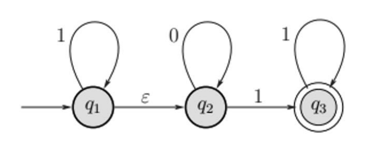
		- מצב $Q_{1}$: מצב התחלתי "מזהה אפס או יותר אחדים בהתחלת הקלט" אוטומט NFA "מנחש" מתי מגיע תור של אפסים ואז עובר למצב $Q_2$. 
		- במצב $Q_{2}$ האוטומט "דואג" לזהות 0 אפס או יותר פעמים ואז כאשר מגיע 1 ראשון עובר למצב $Q_3$
		- מצב $Q_3$: מצב מקבל אוטומט מוכן לקבל 1ים בסוף הקלט ורק אותם.

- ג. בנו ב"ר מעל א"ב $\{a,b\}$ עבור השפה הבאה: $L = \{a^nb^m, n \ge 1, m \ge 1, mn \ge 3\}$.
	- **תשובה:**  $aa^*b^*b^3\cup a^2a^*b^*b^2 \cup a^3a^*b^*b$

## שאלה 2

- א. הוכיחו או הפריכו: נתונות: $L_{1}$ ו-$L_{2}$ שפות לא חסרות-הקשר. אזי $L_{1}\cap L_{2}$ בהכרח לא חסרת הקשר. 
	- **תשובה:** הטענה אינה נכונה. דוגמה נגדית: $L_1 = \{a^nb^nc^n \mid n \ge 0\}$ ו-$L_2 = \{c^nb^na^n \mid n \ge 0\}$ אינן חסרות הקשר (דוגמה 2.36), אבל החיתוך שלהן $L_1 \cap L_2 = \emptyset$ חסרת הקשר.
- ב. הוכיחו או הפריכו: אם נחסיר מספר אינסופי של מילים משפה חסרת הקשר אזי בהכרח נקבל שפה רגולרית.
	- **תשובה:** הטענה אינה נכונה. דוגמה נגדית: ניקח את השפה $\Sigma^*$ שהיא כמובן רגולרית ולכן גם חסרת הקשר, ונחסיר ממנה את השפה האינסופית $L=\{a^nb^n \mid n \ge 0\}$, ונקבל את השפה $A=\Sigma^* \setminus L$ שהיא אינה רגולרית. (שהרי אם $A$ הייתה רגולרית, אזי $\overline{A} =L$ גם הייתה רגולרית (לפי סגירות של רגולריות תחת משלים), אבל שפה זו היא אינה רגולרית (דוגמה 1.73)).  
- ג. בנו דקדוק חסר הקשר עבור המשלים של השפה הבאה: $L=\{a^nb^n \mid n \ge 0\}$
	- **תשובה:** $\overline{L} = {\color{red}\{a^ib^j \mid i > j \}}\cup {\color{Orchid}\{a^ib^j \mid i < j \}} \cup {\color{ForestGreen}(a ∪ b)^∗b(a ∪ b)^∗a(a ∪ b)^∗}$
		- $S \to {\color{red}S_1} \mid {\color{Orchid}S_2} \mid {\color{ForestGreen}S_3}$  
		- $\color{red}{S_1} \to a S_1 b \mid a S_1 \mid a$
		- $\color{Orchid} S_2\to a S_2 b \mid  S_2 b \mid b$
		- $\color{ForestGreen}S_3 \to X b X a X$
		- $X \to a X \mid b X \mid \varepsilon$

## שאלה 3

- א. האם השפה הבאה ניתנת להכרעה על ידי מ"ט. הוכיחו.
$L_1 = \{\langle M \rangle \mid M \text{ is a TM and there exists an input on which } M \text{ halts in less than } |\langle M \rangle| \text{ steps}\}$
	- **תשובה:** השפה ניתנת להכרעה על ידי מ"ט:
		- $\text{``On input }\langle M \rangle$: 
			- Compute $n:=|\langle M \rangle|$.
			- For each input $w$ of length at most $n$:
				- Simulate $M$ on $w$ for at most $n-1$ steps.
				- If $M$ halts, then *accept*.
			- _Reject_. $\text{''}$  
		- אם $\langle M \rangle\in L_1$, אזי קיימת מילה $w$ כך ש- $M$ עוצר עליה תוך פחות מ- $|\langle M \rangle|$ צעדים, מילה זו אינה יכולה להיות ארוכה מ- $|\langle M \rangle|$, ולכן המכונה כן עוברת עליה, ומקבלת אותה. 
		- אם $\langle M \rangle\notin L_1$, אזי $M$ לא עוצר על אף מילה באורך קטן מ- $|\langle M \rangle|$, ולכן המכונה לא מקבלת אף מילה, ולכן לא מקבלת את השפה $L_1$.

- ב. האם השפה הבאה ניתנת לזיהוי? הוכיחו. $\{\langle M \rangle \mid M \text{ is a TM and } |L(M)| \ge 3\}$.
	- **תשובה:** השפה מזוהה-טיורינג.
		- נסמן $s_1,s_2,s_3,\ldots$ את סדרת המילים ב $\Sigma^*$. 
		- "עבור קלט $\langle M\rangle$ כאשר $M$ היא מ"ט:
			- לכל $i=1,2,\ldots$:
				- נריץ את $M$ על כל אחד מ- $s_1,s_2,\ldots,s_i$, _לכל היותר_ $i$ צעדים. 
				- אם $M$ מקבלת מילה כלשהי (שאינה סומנה עדיין על הסרט), נוסיף 1 לקאונטר $j$, ונרשום אותה על הסרט.
				- אם $j\geq 3$, נקבל."
		- אם אכן $L(M)\geq 3$, אז בעצם קיימים לפחות 3 מילים ב- $L(M)$ שעבורם $M$ תקבל במספר סופי של צעדים. המ"ט שבנינו אינה יכולה להיכנס ללופ שהרי הגבלנו את הריצות של $M$ במספר הצעדים.

- ג. האם השפה הבאה ניתנת לזיהוי? $\{\langle M \rangle \mid M \text{ is a TM and } L(M) \text{ is countable}\}$.
	- **תשובה:** כן. השפה ניתנת לזיהוי (ואף כריעה). אם אכן $\langle M \rangle$ הוא תיאור של מ"ט, אזי השפה $L(M)$ היא בת-מניה, שהרי לא קיימת שפה שאינה בת-מנייה מעל אלפבית סופי. אם כן השפה הנתונה היא שפת כל התיאורים של מ"ט. והיא כריעה.

## שאלה 4 

- א. הוכיחו שהבעיה הבאה היא NP שלמה
$\text{DOUBLE-SAT} = \{\langle \phi \rangle | \phi \text{ is a Boolean formula with two satisfying assignments }\}$
	- רמז: רדוקציה לבעיית SAT.
	- **תשובה:**  
		- נראה רדוקציה פולי' מ- $\text{SAT}$ ל- $\text{DOUBLE-SAT}$, כלומר: $\text{SAT} \leq_p \text{DOUBLE-SAT}$.
			-  נגדיר פונקציה כך: $f(\phi) = \phi \land (x \lor \neg x)$, כאשר $x$ הוא משתנה חדש שאינו מופיע ב- $\phi$.
			- כיוון ראשון: אם $\phi\in \text{SAT}$, אז צד שמאל של $f(\phi) = \phi \land (x \lor  \overline{ x })$, כלומר $\phi$, מסופק, לכן גם $x=true$ וגם $x=false$ מספקים את $f(\phi)$, כלומר $f(\phi)\in \text{DOUBLE-SAT}$.
			- כיוון שני: אם $\phi\notin \text{SAT}$, אזי $\phi$ אינה ספיקה, ולכן גם $f(\phi)$ אינה ספיקה, כלומר $f(\phi)\notin \text{DOUBLE-SAT}$.
			- מסקנה: $\phi\in \text{SAT} \iff f(\phi)\in \text{DOUBLE-SAT}$.
			- לכן, $\text{SAT} \leq_p \text{DOUBLE-SAT}$. 
		- מכך, ובגלל שגם $\text{SAT}$ היא NP-שלמה (משפט 7.37), נובע לפי משפט 7.36 ש- $\text{DOUBLE-SAT}$ היא NP-שלמה.
- ב. משולש בגרף לא מכוון מוגדר כתת-גרף בן 3 צמתים כך שיש קשת בין כל זוג של צמתי המשולש (קליקה בגודל 3). הוכיחו ששפה הבאה שייכת למחלקה P:  $\mathrm{Triangle} = \{\langle G \rangle: G \text{ contains at least one triangle}\}$
	- ֹֹ**תשובה:** נראה אלגוריתם פולינומיאלי עבור הבעיה:
		- עבור כל שלשה של צמתים ב- $G$ (סיבוכיות $O(|V|^3)$):
			- בדוק אם יש קשת בין כל זוג של צמתי השלשה. (סיבוכיות $O(|E|^2)$). אם יש, נקבל.   
		- אם סיימנו בלי למצוא משולש, נדחה.
		- סיבוכיות: $O(|V|^3 \cdot |E|^2)$, שהיא פולינומיאלית, ולכן השפה שייכת למחלקה P.

# מבחן לדוגמה 2 

## שאלה 1

- א. תנו דוגמא לשתי שפות רגולריות $L_1$ ו-$L_2$ המקיימות: אף שפה לא מוכלת בשנייה ובנוסף, $(L_1 \cup L_2)^* = L_1^* \cup L_2^*$.
	- **תשובה:** 
		- $L_1=\{a,b,ab\}$, $L_2=\{a,b,ba\}$
		- $L_1 \cup L_2 = \{a,b,ab,ba\}$
		- $(L_1 \cup L_2)^* = \{a,b,ab,ba\}^*$
		- $L_1^* = \{a,b,ab\}^*$, $L_2^* = \{a,b,ba\}^*$
		- $L_1^* \cup L_2^* = \{a,b,ab\}^* \cup \{a,b,ba\}^* = \{a,b\}^*\cup \{a,b\}^* = \{a,b\}^*= \{a,b,ab,ba\}^*$ 
- ב. האם ייתכן: $L_1$ שפה רגולרית, $L_2$ שפה לא רגולרית אבל: $L_1\cap L_2$ לא רגולרית ובו זמנית $L_1 \cup L_2$ רגולרית?
	- **תשובה:** כן. נראה דוגמה: 
		- השפה $L_1 = a^*b^*$ רגולרית. 
		- השפה $L_2 = \{a^nb^n \mid n \ge 0\}$ אינה רגולרית (דוגמה 1.73).
		- האיחוד הוא $L_1 \cup L_2 = a^*b^* \cup \{a^nb^n \mid n \ge 0\} = a^*b^*$, רגולרית. 
		- החיתוך הוא $L_1 \cap L_2 = a^*b^* \cap \{a^nb^n \mid n \ge 0\} = \{a^nb^n \mid n \ge 0\}$, שהיא אינה רגולרית. 
- ג. תהי $L_1, L_2, L_3, \dots$ סדרה אינסופית של שפות רגולריות. האם האיחוד האינסופי של כל השפות בהכרח יהיה שפה רגולרית?
	- **תשובה:** לא בהכרח. דוגמה נגדית: 
		- ניקח את השפות $L_n =\{a^nb^n\}$, שהן כל אחת רגולרית. אמנם איחודן הוא $L = \bigcup_{n=0}^{\infty} L_n = \{a^nb^n \mid n \ge 0\}$, שהיא אינה רגולרית (דוגמה 1.73).
- ד. בנו ב"ר עבור שפה של NFA הבא: 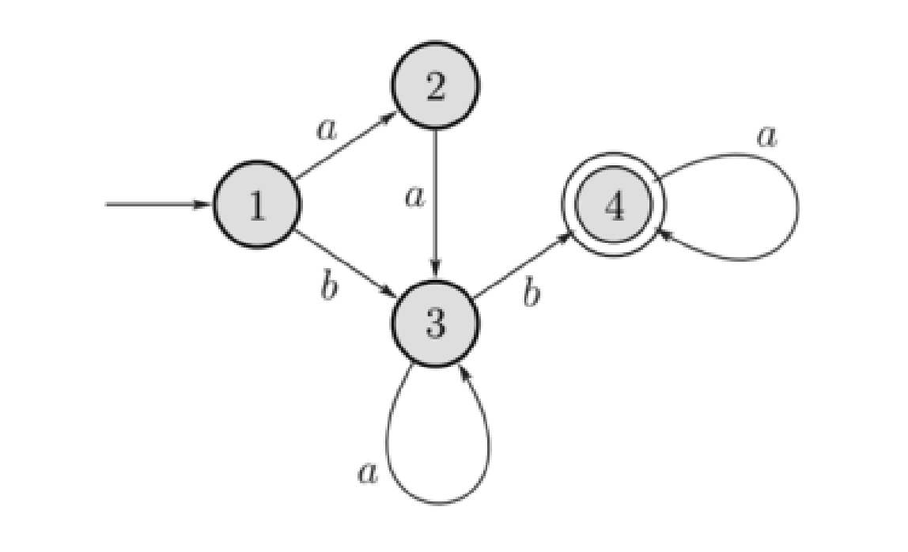
	- **תשובה:** $(aa\cup b)a^* ba^*$

## שאלה 2

- א. תהי $A$ שפה חסרת הקשר המיוצרת בעזרת דקדוק חסר-הקשר $G = (V, \Sigma, R, S)$. בנו דקדוק חסר הקשר $G'$ המייצר את השפה $A^*$. נמקו.
	- **תשובה:** 
		- $G' = (V', \Sigma, R', S')$,
			- $V' = V \cup \{S'\}$ where $S'\notin V$.
			- $R' = R \cup \{S' \to S S' \mid \varepsilon\}$
		- הסבר: השפה $A^*$ היא השפה המתקבלת על ידי חיבור אפס או יותר מחרוזות של השפה $A$. לכן, ניתן להוסיף כלל חדש $S' \to S S'$ שמאפשר לייצר מחרוזות של $A$ ברצף, ואפשר גם לסיים את הגזירה עם $\varepsilon$, כלומר לא לייצר מחרוזת כלל.
- ב. אנו מבצעים תהליך מעבר CFG לדקדוק בצורת חומסקי. 
	- לאחר מספר צעדים התקבל הדקדוק הבא:
		- $S_0 \to S$
		- $S \to 1S A 0 A \mid 0A S1 S \mid \varepsilon$
		- $A \to 10S1 \mid \varepsilon$
	- בצעד הבא רוצים לסלק מעבר אפסילון $A\to \varepsilon$. רשמו דקדוק שיתקבל לאחר צעד זה.
	- **תשובה:**
		- $S_0 \to S$
		- $S \to 1S A 0 A \mid 0A S1 S \mid  \mathbf{ 1SA0B } \mid \mathbf{1S0A}\mid \mathbf{1S0}\mid \mathbf{0S1 S}\mid \varepsilon$
		- $A \to 10S1\mid\cancel{ {\color{red}\varepsilon} }$
- ג. בנו PDA עבור השפה הבאה: $L = \{b^ia^j \mid i \ge j \ge 0\}$. הסבירו את הפתרון.
	- **תשובה:**
		- 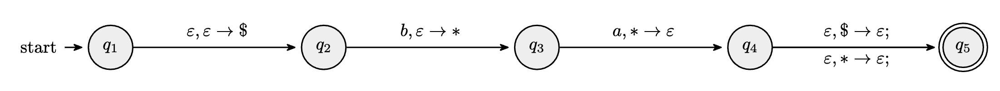
		- בהתחלה, דוחפים למחסנית $\$$ כדי לסמן את תחילת המחסנית.
		- לכל $b$ שקוראים בסרט, דוחפים למחסנית $*$.
		- אחר כך עוברים ל-$a$ים, כל $a$ שקוראים בסרט, מוצאים $*$ מהמחסנית. 
		- בסוף הסרט: 
			- אם קוראים $\$$ מהמחסנית, אז מקבלים. כי זה אומר ש $i=j$.
			- אם קוראים $*$ מהמחסנית, אז מקבלים. כי זה אומר ש $i>j$.
- ד. נתון CFG הבא: $S \to S+S \mid S-S \mid S \times S \mid S/S \mid (S) \mid -S \mid 0 \mid 1 \mid \cdots \mid 9$. האם את הסדרות הבאות אפשר לגזור בדקדוק זה? אם כן בנו עצי גזירה עבורן. 
	- $---5$
	- $2+--4$
	- **תשובה:** אפשר לגזור את שתיהן. 
		- $S \quad\to\quad -S \quad\to\quad --S \quad\to\quad ---S\quad\to\quad---5\quad$
		- $S \quad\to\quad S + S  \quad\to\quad 2 + -S  \quad\to\quad 2 + --S \quad\to\quad 2 + --4$

## שאלה 3

- א. האם השפה $L$ הבאה ניתנת להכרעה? הוכיחו.
$L = \{\langle M \rangle | M \text{ is a TM s.t. there exists some input on which } M \text{ makes at least } 5 \text{ steps}\}$
	- **תשובה:** 
		- $\text{``On input }\langle M \rangle$: (where $\Sigma$ is the input alphabet of $M$)
			- For each input $\displaystyle w\in \bigcup_{i=0}^{5}\Sigma^i$ : (כל הרישות באורך 5 לכל היותר )
				- Simulate $M$ on $w$ for at most $5$ steps. If $M$ does not halt in step 4, then _accept_. 
			- _Reject_. $\text{''}$  
		- האלגוריתם בסוף יסתיים כי יש מספר סופי של קלטים באורך 5 לכל היותר מעל אלפבית סופי וגם כי יש מספר סופי של צעדים שעל כל קלט מריצים את M. אם עברנו על כל הקלטים האפשריים ולא קיבלנו, אז דוחים. 
- ב. תהי $L$ שפה הניתנת לזיהוי על ידי מ"ט ותהי $\overline{L}$ שפה שלא ניתנת לזיהוי על ידי מ"ט. נסתכל בשפה הבאה: $L' = \{0w \mid w \in L\} \cup \{1w \mid w \notin L\}$. האם $L'$ – ניתנת להכרעה? ניתנת לזיהוי? הוכיחו.
	- **תשובה:** 
		- נניח בשלילה ש- $L'$ ניתנת לזיהוי.
			- אזי קיימת מ"ט $M'$ שמזהה את $L'$.
			- נבנה מ"ט $M$: "עבור כל קלט $w$:
				- נריץ את $M'$ על $1w$, אם $M'$ מקבל, נקבל. אם $M'$ דוחה, נדחה." 
			- אם $w\in \overline {L}$, אז $w\notin L$, ולכן $1w\in L'$ ולכן $M'$ מקבל את $1w$, ולכן $M$ מקבל את $w$.
			- אם כן מצאנו מ"ט $M$ המזהה את $\overline{L}$. בסתירה לנתון בשאלה.
			- מסקנה: $L'$ אינה ניתנת לזיהוי.
			- לכן, $L'$ גם אינה ניתנת להכרעה.

## שאלה 4

- א. נסתכל ב-2 שפות הבאות:
	- WVC: given a graph $G(V,E)$, a weight function $w:V \to R^+$, constant $k$. then $\langle G,f,k\rangle$ belongs to WVC if $G$ has a vertex cover of total weight of most $k$.
	- VC: given a graph $G(V,E)$ and integer $k$. Then $\langle G,k \rangle$ belongs to VC if $G$ has a vertex cover of size at most $k$.
	- נניח שידוע ש-$\text{VC}$ שפה NP שלמה. הוכיחו ש-$\text{WVC}$ שפה NP שלמה.
	- **תשובה:** 
		- נראה רדוקציה פולי' מ- $\text{VC}$ ל- $\text{WVC}$. כלומר נראה ש: $\text{VC} \leq_p \text{WVC}$.
		- נגדיר פונקציה כך: $f(\langle G,k\rangle)= (G,w,k)$, כאשר $w(v) = 1$ לכל $v\in V$.
		- בבירור $\langle G,k \rangle \in \text{VC} \iff f(\langle G,k\rangle)=\langle G,w,k \rangle \in \text{WVC}$. והפונקציה ניתנתה לחישוב בזמן פולינומיאלי.
- ב. הוכיחו שהשפה $\text{HALF-CLIQUE}$ היא שפה NP שלמה.
	- גרף $G(V,E)$ לא מכוון שייך לשפה $\text{HALF-CLIQUE}$ אם קיימת ב-$G$ קליקה שמכילה חצי מהצמתים שלו.
	- רמז: רדוקציה מהבעייה $\text{Clique}$. $\langle G,k \rangle$ שייך לשפה אם בגרף לא מכוון יש קליקה בגודל $k$.
	- **תשובה:** 
		- ראשית, $\text{HALF-CLIQUE} \in \text{NP}$, כי בהינתן קבוצת צמתים בגודל $\frac{|V|}{2}$, ניתן לבדוק בזמן פולינומיאלי $O(|V|^2)$ אם יש קשת בין כל זוג צמתים בקבוצה זו.
		- נראה רדוקציה פולי' מ- $\text{Clique}$ ל- $\text{HALF-CLIQUE}$. כלומר נראה ש: $\text{Clique} \leq_p \text{HALF-CLIQUE}$.
		- נגדיר פונקציה כך: $f(\langle G=(V,E),k\rangle)= \langle G'=(V',E')\rangle$, כאשר:
			- אם $k=\frac{|V|}{2}$ : נגדיר את $G'=(V',E')$ להיות גרף עם $E=E'$ ו- $V'=V$.
			- אם $k> \frac{|V|}{2}$ : נגדיר את $G'=(V',E')$ להיות גרף עם $E=E'$ ו- $V'$ יכיל את הצמתים של $G$ וגם נוסיף לו $j$ צמתים חדשים (שלא מחוברים לשום צומת אחר), כאשר $j=2k- |V|$. (ואז מתקיים $k=\frac{|V|+j}{2}=\frac{|V'|}{2}$). 
				- מתקיים ש: ל- $G$ יש קליקה בגודל $k$ אם ורק אם ל- $G'$ יש קליקה בגודל $\frac{|V'|}{2}=k$
			- אם $k<\frac{|V|}{2}$ : נגדיר את $G'=(V',E')$ להיות גרף כאשר $V'$ יכלול את כל הצמתים של $G$ וגם נוסיף לו $j$ צמתים חדשים, כאשר $j=|V|-2k$. (ואז $|V'|=|V|+j=2|V|-2k$). ו- $E'$ יכיל את כל הקשתות של $G$ וגם נוסיף קשתות בין כל $j$ הצמתים החדשים, וגם מכל צומת חדש לכל צומת ב- $G$. 
				- מתקיים ש: ל- $G$ יש קליקה בגודל $k$ אם ורק אם ל- $G'$ יש קליקה בגודל $k+j=|V|-k$.
			- אם $\langle G,k\rangle\in\text{Clique}$, 
			- אם כן: $\langle G,k\rangle\in\text{Clique} \iff \langle G'\rangle\in\text{HALF-CLIQUE}$.
			- מאחר ש: CLIQUE היא NP-שלמה (מסקנה 7.43), נובע ש- $\text{HALF-CLIQUE}$ גם היא NP-שלמה (לפי משפט 7.36).

# מבחן לדוגמה 3

## שאלה 1
 
- א. בנו DFA עבור כל אחד מהברי"ם הבאים. תנו הסבר קצר.
	- $r=(11\cup 10)^*$
		- **תשובה:** 
			- 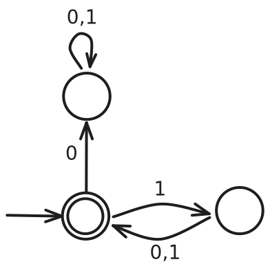
	- $r=(1 \cup 110)^*0$
	- **תשובה:**  
		- 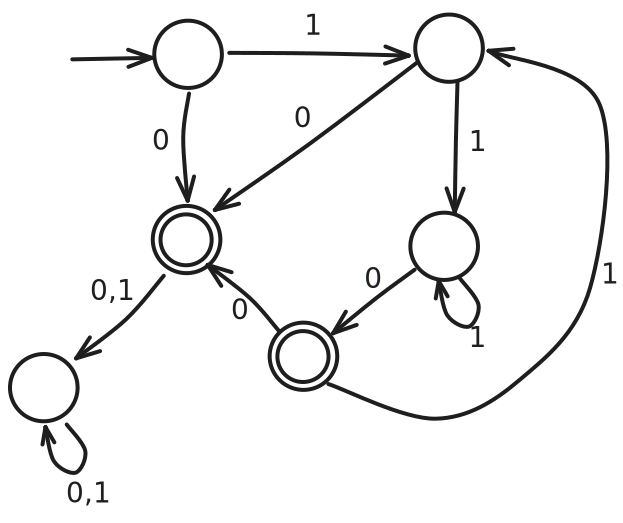
- ב. הפכו את ה NFA הבא ל- DFA שקול.
	- 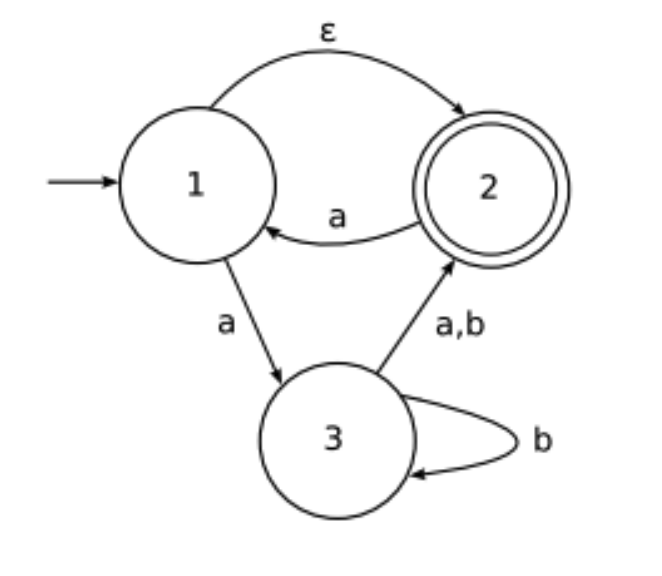
	- **תשובה:** 
		- 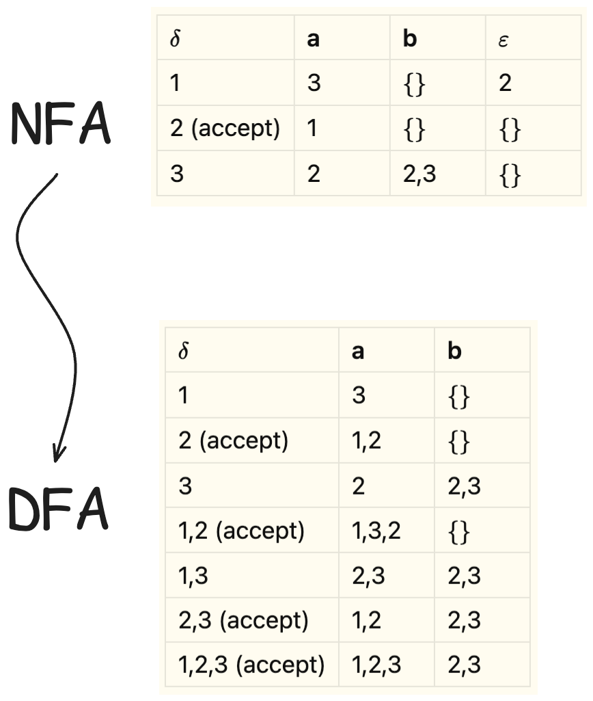

- ג. בנו DFA מעל $\{a,b\}$ עבור השפה הבאה: 
	- $L_1 = \{w \mid w \ne ba, \text{ and } w \text{ does not contain } bab\}$.
		- **תשובה:** 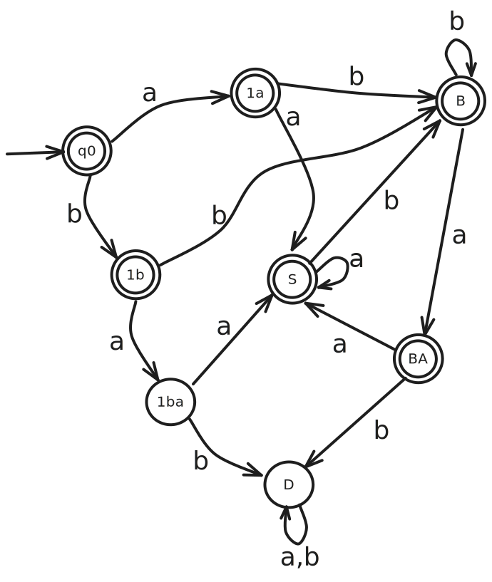

## שאלה 2

- א. ו- ב. ראו מועד 2024b-94 שאלה 2
- ג. האם השפה הבאה חסרת הקשר? $L = \{ a^i b^j c^k \mid k>j>i \}$.
	- **תשובה:** 
		- נניח בשלילה ש- $L$ חסרת הקשר.
			- אזי קיים אורך ניפוח $p$.
			- ניקח את המילה $w=a^p b^{p+1} c^{p+2}$.
			- לפי הלמה ניתן לכתוב $w=uvxyz$, כאשר $|vxy| \leq p$ ו- $|vy|>0$.
				- מקרה 1: אם $vxy$ מכילה לפחות $a$ אחד, אז $vxy$ בוודאי אינה מכילה $c$-ים, אם כן $uv^2xy^2z$ מכילה לפחות $p+1$ $a$-ים, אבל יהיה בה בדיוק $p+2$ $c$-ים. כלומר לא יתכן ש-$k>j>i$. ואז $uv^2xy^2z \notin L$. סתירה.
				- מקרה 2: אם $vxy$ אינה מכילה $a$-ים, אז היא מכילה לפחות $b$ אחד או לפחות $c$ אחד. אם כן כאשר ננפח למטה, נקבל שמספר ה-$b$-ים או ה-$c$-ים ירד, אבל מספר ה-$a$-ים נשאר אותו דבר. ואז גם לא יתכן ש-$k>j>i$. ואז $uv^2xy^2z \notin L$. סתירה.
		- מסקנה: $L$ אינה חסרת הקשר.

## שאלה 3 

ראו מועד 2024b-94 שאלה 3.

## שאלה 4 

- א. הוכיחו ששפה הבאה לא כריעה:
	- $\text{USELESS}_{\text{TM}}=\{ \langle M, q \rangle \mid q \text{ is a useless state in TM }M\}$
	- הדרכה: רדוקציה מבעיה $E_\text{TM}=\{ \langle M \rangle \mid M \text{ is a TM and } L(M)=\emptyset \}$.
	- **תשובה:** 
		- נניח בשלילה ש- $\text{USELESS}_{\text{TM}}$ ניתנת להכרעה ע"י מ"ט $R$.
			- נשים לב שעבור מ"ט $M$ עם מצב מקבל $q_\text{accept}$, מתקיים ש- $q_\text{accept}$ הוא useless state אםם $L(M)=\emptyset$.
			- נבנה מ"ט $S$ כך: "עבור כל קלט $\langle M \rangle$, כאשר $M$ היא מ"ט:
				- נריץ את $R$ על $\langle M, q_\text{accept} \rangle$.
				- אם $R$ מקבל, אז _נדחה_. אחרת, _נקבל_."
			- מ"ט זו מכריעה את $\text{E}_{\text{TM}}$, כי אם $L(M)=\emptyset$ אז $q_\text{accept}$ הוא useless state, ואם $L(M)\ne\emptyset$ אז $q_\text{accept}$ אינו useless state.
			- אבל $\text{E}_{\text{TM}}$ אינה ניתנת להכרעה לפי משפט 5.2. סתירה.
		- מסקנה: $\text{USELESS}_{\text{TM}}$ אינה ניתנת להכרעה.
- ב. הוכיחו שלא קיימת רדוקציית מיפוי מ- $A_{\text{TM}}$ ל- $E_{\text{TM}}$. (תרגיל 5.5 בספר)
	- רמז: הוכחה בדרך השלילה ותכונות ידועות של $A_{\text{TM}}$ ו- $E_{\text{TM}}$.
	- **תשובה:** 
		- נניח בשלילה ש- $A_{\text{TM}} \leq_{\text{m}} E_{\text{TM}}$ בעזרת רדוקציית מיפוי $f$.
		- אזי $w\in A_{\text{TM}} \iff f(w) \in E_{\text{TM}}$.
		- באופן שקול: $w\notin A_{\text{TM}} \iff f(w) \notin E_{\text{TM}}$.
		- כלומר $w\in\overline{A_{\text{TM}}} \iff f(w) \in \overline{E_{\text{TM}}}$.
		- כלומר $\overline{A_{\text{TM}}} \leq_{\text{m}} \overline{E_{\text{TM}}}$.
		- כמו כן ידוע ש- $\overline{A_{\text{TM}}}$ אינה מזוהה -טיורינג (מסקנה 4.23), ו- $\overline{E_{\text{TM}}}$ היא כן מזוהה -טיורינג (תרגיל 4.5 בספר). אבל אם קימת רדוקציית מיפוי מ- $\overline{A_{\text{TM}}}$ ל- $\overline{E_{\text{TM}}}$ נובע ש- $\overline{A_{\text{TM}}}$ מזוהה -טיורינג, (או ש- $\overline{E_{\text{TM}}}$ אינה מזוהה -טיורינג). סתירה.
		- מסקנה: לא קיימת רדוקציית מיפוי מ- $A_{\text{TM}}$ ל- $E_{\text{TM}}$.
- ג. ידוע ש- $A\leq_{\text{m}} B$ ובנוסף ידוע ש- $B$ שפת רגולרית. האם בהכרח $A$ שפה רגולרית? (תרגיל 5.4 בספר)
	- **תשובה:** לא בהכרח. דוגמה נגדית:
		- השפה $A=\{0^n1^n \mid n \ge 0\}$ אינה רגולרית.
		- השפה $B=\{ 1 \}$ סופית ולכן רגולרית. 
		- נגדיר פונקציה:  $f(w)=\begin{cases} 1 & \text{if } w \in A \\ 0 & \text{if } w \notin A \end{cases}$. (פונקציה זו ניתנת לחישוב כי $A$ חסרת הקשר ולכן גם ניתנת להכרעה), 
			- כמו כן מתקיים $w\in A \iff f(w)=1 \iff f(w)\in B$, ולכן זו פונקציית רדוקציית מיפוי: $A \leq_{\text{m}} B$.

## שאלה 5

ראו מועד 2024b-94 שאלה 4.

# מועד 2024b-65

## שאלה 1

- א. האם השפה הבאה מעל הא"ב $\{a,b\}$ היא שפה רגולרית? הוכיחו את טענתכם. $A = \{w \in \Sigma^* : |w| \text{ is odd, and the middle symbol of } w \text{ is } b\}$
	- כלומר, השפה $A$ מורכבת מכל המילים באורך אי-זוגי, כאשר האות האמצעית במילה היא $b$.
	- **תשובה:** 
		- ניקח את $w=a^pba^q$ שנמצאת בשפה $A$. 
		- לפי למת הניפוח, $w$ ניתנת לכתיבה כ-$w=xyz$, כאשר $|xy|\leq p$ ו-$|y|>0$. 
		- לכן $xy$ מורכבת רק מ- $a$ים.
		- אם ננפח את $y$ למעלה, $b$ כבר לא יהיה באמצע המילה, לכן הניפוח יהיה בשפה. בסתירה ללמה. מסקנה: $A$ אינה רגולרית.   
- ב. בנו ביטוי רגולרי מעל הא"ב $\{a,b\}$ המייצג כל המחרוזות באורך אי זוגי המסתיימות באות $b$.
	- **תשובה:** $((a\cup b)(a\cup b))^* b$
- ג. בנו ביטוי רגולרי שמייצר את השפה שה-NFA הבא מזהה. 
- 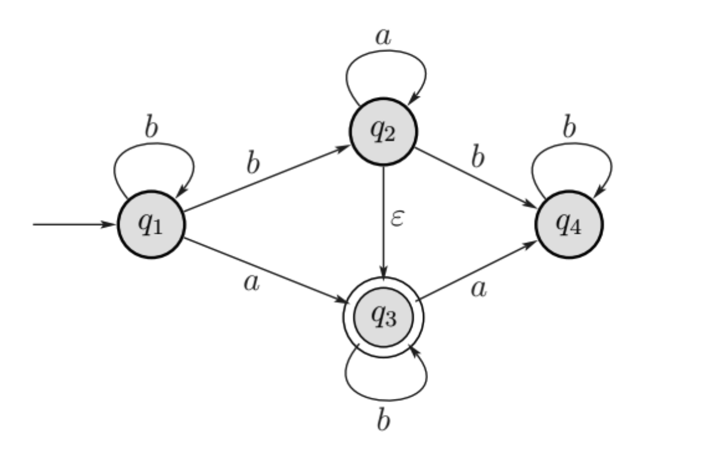
	- **תשובה:** 
	- $b^* (a \cup ba^*) b^*$

## שאלה 2

- א. תהיינה C,B,A שפות חסרות-הקשר.
	- קבעו לגבי כל אחת מהשפות הבאות אם היא שפה חסרת הקשר. יש להוכיח את טענתכם.
$\overline{A}(B \cup C)$
$A(B \cup C)$
- **תשובה:**
	- השפה $\overline{A}(B \cup C)$ אינה בהכרח חסרת הקשר. דוגמה נגדית: ניקח את $B$ ו- $C$ להיות שתי שפות ריקות. ואת $\overline{A}$ להיות שפה שאינה חסרת הקשר. 
	- השפה $A(B \cup C)$ היא חסרת הקשר, מאחר ששפות חסרות הקשר סגורות תחת איחוד ושרשור.
- ב. נתון הדקדוק הבא: $\{S \to AB, S \to \epsilon, A \to aB, B \to Sb\}$
	- הוכיחו שהדקדוק זה יכול לגזור את המחרוזות $aabbbb$. 
		- **תשובה:** נראה גזירה:
			- $S$
			- $AB$ 
			- $aBB$
			- $aSbSb$
			- $aABbb$
			- $aaBSbbb$
			- $aaSbbbb$
			- $aabbbb$
	- האם אפשר לגזור בדקדוק הזה את המחרוזת: $bbba$
		- **תשובה:** לא. המילה לא יכולה להתחיל באות $b$.

## שאלה 3

יהיה $G$ גרף לא מכוון. נגדיר את שתי השפות הבאות:
$\text{SPATH} = \{\langle G, a, b, k \rangle | G \text{ contains a simple path of length at most } k \text{ from } a \text{ to } b\}$
$\text{LPATH} = \{\langle G, a, b, k \rangle | G \text{ contains a simple path of length at least } k \text{ from } a \text{ to } b\}$

- א.הוכיחו שהשפה $\text{SPATH}$ שייכת למחלקה P.
	- **תשובה:** תיאור אלגוריתם: "עבור קלט $\langle G, a, b, k \rangle$ כאשר $m$ הוא מספר הצמתים בגרף $G$: 
		- נסמן את צומת $a$ ב- $0$.
		- עבור כל $i$ מ- $1$ עד $m$:
			- אם קיימת קשת $(s,t)$ המחברת בין צומת $s$ המסומנת ב- $i$ לצומת $t$ שאינה מסומנת, נסמן את $t$ ב- $i+1$.  
		- אם $b$ מסומנת בערך קטן או שווה ל- $k$, *נקבל*, אחרת, *נדחה*."
- ב. הוכיחו שהשפה $\text{LPATH}$ היא NP-שלמה.
	- רמז: אפשר להניח ש- $\text{UHAMPATH}$ היא NP-שלמה; 
	- נזכיר ש- $\text{UHAMPATH}$ היא שפת כל המחרוזות $\langle G, a, b \rangle$ כאשר $G$ הוא גרף, ו $a$-ו $b$-הם צמתים בגרף $G$ וקיים מסלול המילטוני מהצומת $a$ לצומת $b$.
	- **תשובה:**
		- ראשית, $\text{LPATH}$ היא NP. כי אם יש לנו מסלול באורך גדול או שווה ל- $k$, נוכל לבדוק את המסלול הזה בזמן פולינומיאלי.
		- נראה ש- $\text{LPATH}$ היא NP-שלמה: 
			- בעזרת רדוקציה מ- $\text{UHAMPATH}$ ל- $\text{LPATH}$: "עבור קלט $\langle G, a, b \rangle$ כאשר $a$ ו- $b$ הם צמתים בגרף $G$:
				- יהי $k$ מספר הצמתים בגרף $G$.
				- נדפיס את $\langle G, a, b, k \rangle$."
			- אם $\langle G, a, b \rangle\in \text{UHAMPATH}$, אזי $G$ מכיל מסלול המילטוני באורך $k$, מ- $a$ ל- $b$, אזי $\langle G, a, b, k \rangle\in \text{LPATH}$.
			- אם $\langle G, a, b, k \rangle\in \text{LPATH}$, אזי $G$ מכיל מסלול פשוט באורך $k$, מ- $a$ ל- $b$, אבל ל-$G$ יש $k$ צמתים, אזי המסלול הוא מסלול המילטוני, כלומר $\langle G, a, b \rangle\in \text{UHAMPATH}$.

## שאלה 4

- א. הוכיחו או הפריכו: "נתון שהשפות $L_1$ ו-$L_2$ ניתנות להכרעה. כמו כן ידוע ש- $L_1\subseteq L \subseteq L_2$. אזי $L$ ניתנת להכרעה."
	- **תשובה:** הטענה אינה נכונה. דוגמה נגדית: $L_1=\emptyset$, $L_2=\Sigma^*$, ו- $L$ שפה בלתי כריעה כלשהיא מעל הא"ב $\Sigma$.  
- ב. נתונה מ"ט:
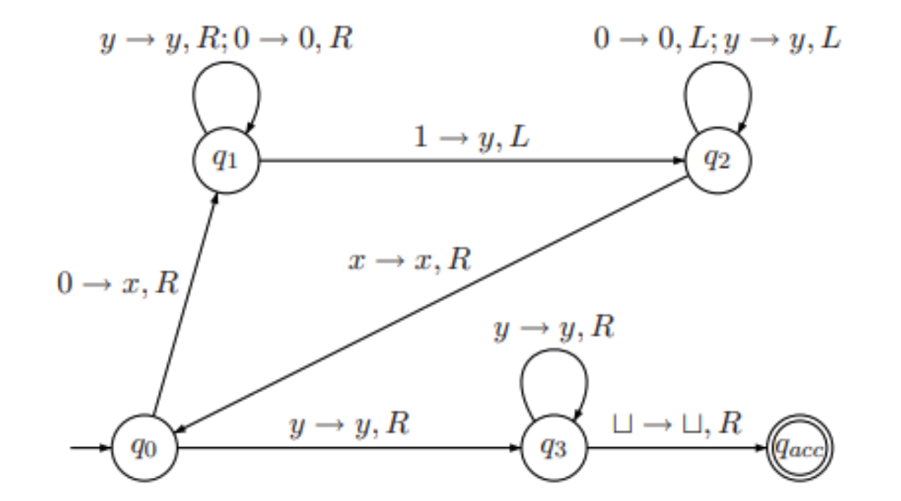

- כאשר $\Sigma=\{0,1\}$, ו- $\Gamma=\{0,1,x,y,\sqcup\}$, וכל המעברים שאינם מצויירים באיור מובילים למצב דוחה.
	- מהי השפה שמכונה זו מזהה?
		- **תשובה:** $L=\{w\in\Sigma^*| w=0^n1^n,n\geq 1\}$ 
	- רשמו סדרת קונפיגורציות חישוב של המכונה על הקלט $01$.
		- **תשובה:**
			- $q_0 01$
			- $xq_1 1$
			- $q_2 x y$
			- $xq_0 y$ 
			- $x yq_3 \sqcup$  
			- $xyq_{acc}\sqcup$ 

# מועד 2024b-94

## שאלה 1

- א. הוכיחו שהשפה הבאה מעל הא"ב $\{a,b\}$ רגולרית: $L_1 = \{w \mid w \ne ba, \text{ and } w \text{ does not contain } bab\}$.
	- **תשובה:** 
		- השפה $\Sigma^*$ רגולרית.
		- השפה $\{ ba \}$ סופית ולכן רגולרית. 
		- השפה $L_2 = \{w \mid w \text{ contains } bab\}$ רגולרית. (ביטוי רגולרי: $(a\cup b)^* bab (a\cup b)^*$).
		- לכן השפה $L_1 = \Sigma^* \setminus (\{ ba \} \cup L_2)$ היא רגולרית (סגירות תחת איחוד וחיסור קבוצות).
- ב. נסתכל בשפה הבאה מעל הא"ב $\{0,1\}$. $L = \{www \mid w \text{ starts with } 0\}$
	- אדם מנסה להוכיח ש-$L$ שפה רגולרית. הוא כתב את ההוכחה הבאה:
		1. תהי $M = \{w \mid w \text{ starts with } 0\}$ שפה רגולרית (כי קיים DFA עבורה).
		2. השפה $L$ היא שרשור של 3 שפות $M$, כלומר $L=MMM$.
		3. ידוע ששפות רגולריות סגורות תחת שרשור ולכן $L$ רגולרית.
	- האם הנימוק של אדם נכון או שגוי? נמקו את תשובתכם.
		- **תשובה:** שגוי. 
			- השפה $L$ מורכבת מכל המילים שהם רצף של 3 מחרוזות _זהות_ שמתחילות ב- $0$. אבל השפה $MMM$ מורכבת מכל המילים שהן רצף של 3 מחרוזות שהן _לא בהכרח זהות_ שמתחילות ב- $0$.
- ג. הוכיחו שהשפה $L$ מהסעיף הקודם אינה רגולרית.
	- **תשובה:** 
		- נניח בשלילה ש-$L$ רגולרית, אזי קיים אורך ניפוח $p$.
		- ניקח את המילה $s=01^{p-1}01^{p-1}01^{p-1}$, שהיא מילה באורך $3p$ השייכת לשפה $L$.
		- לפי למת הניפוח, ניתן לכתוב $s=xyz$, כאשר $|xy|\leq p$ ו-$|y|>0$.
		- אם $|x|>0$ אזי $x$ מתחיל ב- $0$, ולכן $y$ מכיל רק $1$ים, ולכן ניפוח של $y$ יגרום לכך ש-$s$ היא לא מהצורה $www$, כלומר לא תהיה שייכת לשפה $L$.
		- אם $|x|=0$ אזי $y=01^{p-1}$, ולכן גם במקרה זה אחרי ניפוח של $y$ למטה נקבל מילה מהצורה $ww$ שלא תהיה שייכת לשפה $L$.

## שאלה 2

- א. הדיאגרמה הבאה מראה היררכיה של השפות שלמדנו בקורס. (ראו רשימה למטה). רשמו בכל אליפסה, לאיזו מחלקת שפות היא מתייחסת. כמו כן, לכל אחת מחמש המחלקות תנו דוגמה לשפה אחת מתוך המחלקה שאינה שייכת לאף מחלקה (אליפסה) חלקית. אין צורך לנמק בחירה זו. השפות: ניתנות לזיהוי על ידי מ"ט, שפות רגולריות, שפות ניתנות להכרעה ע"י מ"ט, שפות חסרות הקשר, שפות לא ניתנות להכרעה.  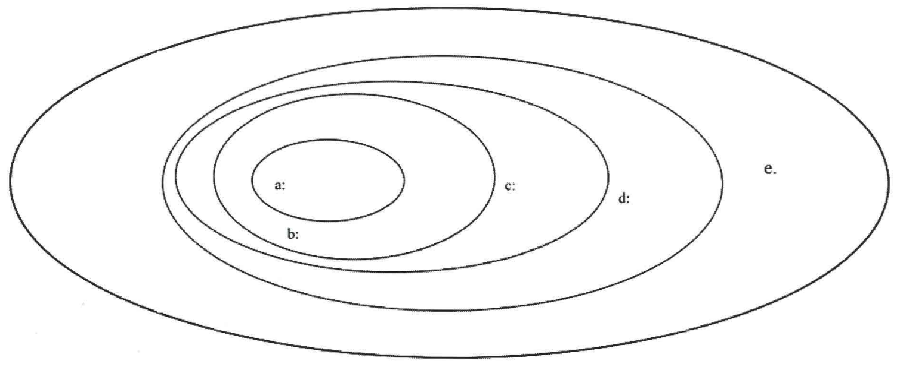
	- **תשובה:** 
		- a: regular (e.g. $L=\{a^n\}$)
		- b: CFL (e.g. $L=\{a^nb^n\}$)
		- c: decidable (e.g. $L=\{a^nb^nc^n\}$) 
		- d: non-decidable (e.g. $HALT_{TM}$)
		- e: turing-recognizable (e.g. $HALT_{TM}$)
- ב.יהיו $A$ ו-$B$ שפות חסרות-הקשר. האם בהכרח $A\setminus B$ חסרת-הקשר? כלומר האם המחלקה CFL סגורה תחת הפרש קבוצות? 
	- **תשובה:** לא בהכרח.
		- מאחר ששפות חסרות הקשר אינן סגורות תחת משלים, קיימת שפה חסרת הקשר $L$ כך ש- $\overline{L}$ אינה חסרת הקשר.
		- כעת אם $A=\Sigma^*$ ו-$B=L$, אזי $A$ ו-$B$ חסרות הקשר, אבל $A\setminus B = \Sigma^* \setminus L = \overline{L}$ אינה חסרת הקשר.
- ג. הוכיחו שהשפה הבאה אינה חסרת-הקשר $L=\{0^j1^k \mid k>j^2\}$.
	- **תשובה:** נניח בשלילה ש- $L$ חסרת הקשר.
		- לפי למת הניפוח, קיים אורך ניפוח $p$.
		- ניקח את המילה $w=0^p1^{p^2+1}\in L$.
		- לפי למת הניפוח, ניתן לכתוב $w=uvxyz$ כאשר $|vxy|\leq p$ ו-$|vy|>0$.
		- מקרה 1: $vxy$ מכילה רק אפסים, ואז ניפוח למעלה $uv^2xy^2z$ יפר את האי-שוויון $k>j^2$ כי:
			- $j=|0^{p+|v|+|y|}|=p+|v|+|y|\geq p+1$
			- $j^2\geq (p+1)^2=p^2+2p+1\geq p^2+1=k$
		- מקרה 2: אם $vxy$ מכילה רק אחדים, ואז ניפוח למטה $uv^0xy^0z$ יפר את האי-שוויון $k>j^2$ כי:
			- $j=|0^p|=p$
			- $k=|1^{p^2+1-(|v|+|y|)}|=p^2+1-(|v|+|y|)\leq p^2=j^2$ 
			- $k\leq j^2$
		- מקרה 3: אם  $v=0^{|v|}$, $y=1^{|y|}$, $x=\varepsilon$. אז $0<|v|+|y|\leq p$.
			- If $|v|>|y|$, 
				- $|v|\geq |y|+1$.
				- $uv^2xy^2z=0^{p+|v|}1^{p^2+1+|y|}$.
				- $2p|v|+|v|^2\geq |v| \geq 1+|y|$.
				- $p^2+2p|v|+|v|^2\geq p^2+1+|y|$.
				- $(p+|v|)^2\geq p^2+1+|y|$. 
				- $j^2\geq k$
			- If $|y|>|v|$, 
				- $uv^0xy^0z=0^{p-|v|}1^{p^2+1-|y|}$.
				- $|y|\geq |v|+1$.
				- $-|v|\geq 1-|y|$.
				- $-2p|v|+|v|^2\geq 1-|y|$.
				- $p^2-2p|v|+|v|^2\geq  p^2+1-|y|$.
				- $(p-|v|)^2\geq p^2+1-|y|$. 
				- $j^2\geq k$
		- מקרה 4: ש- $y$ מכילה גם אפסים וגם אחדים. (או ש- $v$ מכילה גם אפסים וגם אחדים) כמובן לא יתכן שהרי ניפוח למעלה יביא אותנו לצורה כזו: $w=00...0011..0011..11$.
		- בכל המקרים הגענו לכך ש- $k\leq j^2$, בסתירה לאי-שוויון $k>j^2$. כלומר הניפוח לא נמצא ב- $L$. בסתירה ללמה.
		- מסקנה: $L$ אינה חסרת הקשר.

## שאלה 3

- א. האם השפה הבאה ניתנת לזיהוי על ידי מ"ט. הוכיחו או הפריכו. $L = \{\langle M \rangle \mid M \text{ is a TM and } M \text{ accepts at least one palindrome}\}$. בשפה $L$ יש קידודים של כל מ"ט המקבלות לפחות פלינדרום אחד.
	- **תשובה:** כן, השפה ניתנת לזיהוי על ידי מ"ט.
		- נראה מ"ט שמזהה את השפה $L$: 
		- $P=\text{``On input }\langle M \rangle$:
			- Extract the input alphabet $\Sigma$ of $M$.
			- Enumerate all strings over $\Sigma$ in lexicographic order: $w_1, w_2, \ldots$.
			- For each $i\in \mathbb{N}$: 
				- Simulate $M$ for at most $i$ steps on each input $w_1, w_2, \ldots, w_i$. If $M$ accepts any of these strings, _accept_.
		- אם $M$ אכן מקבל פלינדרום, אז $P$ יקבל בסופו של דבר, שהרי $P$ רץ מספר סופי של צעדים לפני שיגיע לאותו פלינדרום.
- ב. הוכיחו ששפה הבאה ניתנת להכרעה על ידי מ"ט דטרמיניסטית $L = \{\langle M \rangle | M \text{ is a TM and if we start } M \text{ with a blank input tape, then it will finally write}$
$\text{some non-blank symbol on its tape.}\}$
	 בשפה $L$ יש קידודים של כל מכונות טיורינג שמקיימות את התנאי הבא: אם המכונה מתחילה לעבוד עם סרט ריק, אז היא תרשום עליו לפחות תו אחד ששונה מרווח.
	 - **תשובה:**
		 - נראה מ"ט דטרמיניסטית $M$ שמכריעה את השפה $L$:
			 - $\text{``On input }\langle M \rangle$, where $M$ is TM with $m$ states:
				 - Simulate $M$ step-by-step for up to $m$ transitions.
					 - If during the simulation $M$ writes a non-blank symbol on the tape, _accept_.
				 - Otherwise, _reject_.$\text{"}$
		- לאחר $m$ מעברים, 
			- אם אכן $M$ כתבה non-blank symbol, אז נקבל, כי אכן $M$ נמצאת ב- $L$.
			- אם לא נכתב non-blank symbol, המ"ט יכולה להיות לכל היותר ב- $m+1$ מצבים. לא יתכן שכולם שונים, כי יש רק $m$ מצבים ("עקרון שובך היונים"...), לכן בסדרת קונפיגורציות אחרי ה-$m$ מעברים, יהיו לפחות 2 קונפיגורציות עם מצב זהה, בשלבים $i$ ו- $j$ (כאשר $0\leq i < j \leq m$), עם קלט זהה $\sqcup$ שהרי לא כתבנו non-blank symbol, (למעט אולי מיקום הראש שונה). אם כן ההתנהגות של $M$ אחרי שלב $j$ תהיה זהה להתנהגות של $M$ אחרי שלב $i$, אם כן $M$ מחזורית אחרי שלב $i$ ותכנס ללואה אינסופית בלי לכתוב non-blank symbol, ולכן $M$ לא שייכת ל- $L$.

## שאלה 4

- א. הוכיחו או הפריכו: אם השפה $\text{VERTEX-COVER}$ שייכת למחלקה P, אזי גם השפה $\text{HAMPATH}$ שייכת למחלקה P.
	- $\text{HAMPATH} = \{\langle G, s, t \rangle \mid G \text{ is a directed graph with a Hamiltonian path from } s \text{ to } t\}.$
	- $\text{VERTEX-COVER} = \{\langle G, k \rangle \mid G \text{ is an undirected graph that has a k-node vertex cover}\}.$
	- הערה: מותר להסתמך על משפטים שהוכחו בקורס מבלי להוכיח אותם כאן.
	- **תשובה:** הטענה נכונה. 
		- ידוע ש- $\text{HAMPATH} , \text{VERTEX-COVER}\in\text{NP-complete}$. (משפטים 7.44, 7.46).
		- נתון בשאלה ש- $\text{VERTEX-COVER}\in \text{P}$. 
		- לפי משפט 7.35 אם $B\in \text{P}$ ו- $B\in \text{NP-complete}$, אזי $\text{P}=\text{NP}$.
		- מאחר ש- $\text{HAMPATH}\in \text{NP-complete}$, נובע ש- $\text{HAMPATH}\in \text{NP}$, לכן $\text{HAMPATH}\in \text{P}$.
- ב. הוכיחו שהשפה הבאה שייכת למחלקה NP
$\text{SET-PARTITION} = \{\langle x_1, \dots, x_n \rangle | \text{there is a set } S \subseteq \{1, \dots, n\} \text{ so that } \sum_{i \in S} x_i = \sum_{i \notin S} x_i\}$
	- כלומר, רשימת מספרים שלמים חיוביים שייכת לשפה SET-PARTITION אם אפשר לחלק את המספרים ברשימה לשתי רשימות זרות בעלות אותו סכום.
		- **תשובה:** ניתן לאמת חלוקה נתונה בזמן פולינומיאלי. סכימה של כל רשימה, ובדיקה שהסכומים שווים, היא לינארית, בדיקה שהרשימות זרות, היא ריבועית. לכן SET-PARTITION שייכת ל-NP. 
- ג. הוכיחו שהשפה Set-Partition היא NP-שלמה. רמז: העזרו בעובדה שהשפה הבאה היא NP-שלמה: $\text{SUBSET-SUM} = \{\langle x_1, \dots, x_m, t \rangle | \text{there is a set } S \subseteq \{1, \dots, m\} \text{ so that } \sum_{i \in S} x_i = t\}$.
	- **תשובה:** נראה רדוקציה פולינומיאלית מ- $\text{SUBSET-SUM}$ ל- $\text{SET-PARTITION}$. כלומר $\text{SUBSET-SUM} \leq_p \text{SET-PARTITION}$.
		- נסמן את הסכום של כל המספרים ברשימה $x_1, \dots, x_m$ כ- $S$.
		- נגדיר פונקציה כך: 
		- $f(w)=f(\langle x_1, \dots, x_m, t \rangle) = \langle x_1, \dots, x_m, S-2t\rangle$. 
		- כיוון ראשון: אם $\langle x_1, \dots, x_m, t \rangle\in \text{SUBSET-SUM}$, אזי קיימת תת-קבוצה של $w=\langle x_1, \dots, x_m\rangle$ כך שסכום המספרים בה הוא $t$. 
			- לכן סכום המספרים שאינם בתת-קבוצה הזו של $w$ הוא $S-t$, ולכן הסכום של $f(w)=\langle x_1, \dots, x_m, S-2t\rangle$ הוא $S+(S-2t)=2S-2t=2(S-t)$, ולכן ניתן לחלק את המספרים ב- $f(w)$ לשתי רשימות בעלות אותו סכום $S-t$. 
			- אם כן: $\langle x_1, \dots, x_m, S-2t\rangle\in \text{SET-PARTITION}$.
		- כיוון שני: אם $\langle x_1, \dots, x_m, S-2t\rangle\in \text{SET-PARTITION}$, אז ניתן לחלק את המספרים לשתי רשימות בעלות אותו סכום $S-t$. 
			- לכן סכום המספרים ברשימה השנייה הוא $S-t$, כלומר סכום המספרים ברשימה הראשונה הוא $t$, כלומר $\langle x_1, \dots, x_m, t \rangle\in \text{SUBSET-SUM}$.

# מועד 2025a-a1
2025a-64  =  2025a-84 

## שאלה 1

- א. בנו אוטומט סופי מעל הא"ב הבינרי $\{0,1\}$ המקבל את כל המחזורות שבהן מופיעה התת מחזורת $111$ בדיוק פעם אחת. (לצורך ההבהרה האוטומט לא יקבל מחרוזת שקיימת בה התת-מחרוזת $1111$)
	- **תשובה:**  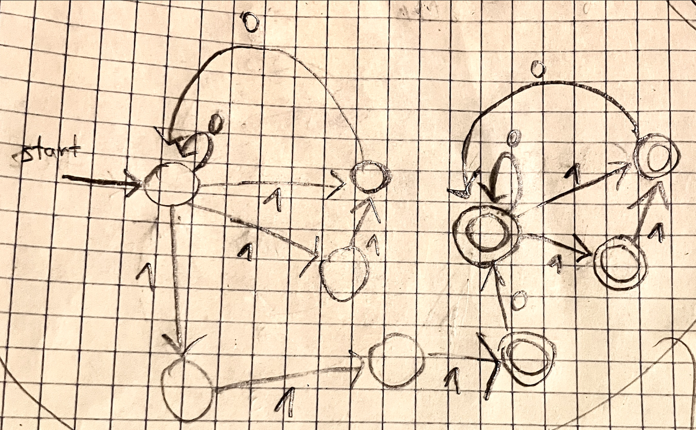
- ב. בנו ביטוי רגולרי עבור כל אחת מהשפות הבאות. תנו הסבר קצר לתשובה.
	- $B=\{ w \in \{ 0,1 \}^* \mid |w| \text{ is a multiple of }3 \}$.
	- $C=\{ w \in \{ 0,1 \}^* \mid w \text{ has at least two 0 or at most one 1} \}$.
	- **תשובה:** 
		- $R_{B}=((0\cup 1)(0\cup 1)(0\cup 1))^*$
		- $R_{C}=((0\cup 1)^* 0 (0\cup 1)^* 0 (0\cup 1)^*) \cup (0^*(\varepsilon \cup 1)0^*)$
- ג. ( יהיו $A,B$ שפות מעל אותו א"ב. ידוע ש-$AB$ ($A$ שרשור $B$) היא שפה רגולרית. האם בהכרח $A$ שפה רגולרית? הסבירו.
	- תזכורת: $AB=\{ w \mid w=ab, a \in A, b \in B \}$.
	- **תשובה:** $A$ אינה בהכרח רגולרית. דוגמה נגדית:
		- השפה $A=\{0^n1^n \mid n \ge 0\}$ אינה רגולרית.
		- השפה $B=\Sigma^*$ רגולרית.
		- נובע ש- $AB=B$. לכן $AB$ רגולרית.

## שאלה 2

- א. האם השפה הבאה היא שפה חסרת-הקשר? הוכיחו את תשובתכם.
	- $L=\{a^kb^nc^m: k,n,m \geq 0, n\leq k \leq m\}$. 
	- **תשובה:** נניח בשלילה ש- $L$ היא חסרת הקשר.
		- לפי הלמה קיים אורך ניפוח $p$.
		- נבחר מילה $w=a^pb^p c^p\in L$.
		- לפי הלמה ניתן לכתוב $w=uvxyz$, כאשר $|vxy|\leq p$, $|vy|>0$ ו- $uv^ixy^iz\in L$ לכל $i\geq 0$.
		- מאחר ש- $|vxy|\leq p$, אזי או $vxy\subseteq a^p b^p$ או $vxy\subseteq b^p c^p$.
		- מקרה 1: $vxy\subseteq a^p b^p$.
			- ננפח למעלה $uv^2xy^2z=a^{p+|v|}b^{p+|y|}c^p$. (מניחים ש-$y$ מכילה רק $b$ים ו-$v$ מכילה רק $a$ים. כי אחרת ניפוח למעלה יביא למחרוזת לא מהצורה $a^kb^nc^m$). 
			- מאחר ש- $|vy|>0$, אזי או $|v|>0$ או $|y|>0$.
				- אם $|v|>0$, אז $k=p+|v|>p=m$. כלומר לא מתקיים $n\leq k \leq m$. ואז $w\notin L$.
				- אם $|y|>0$, אז $n=p+|y|>p=m$. כלומר לא מתקיים $n\leq k \leq m$. ואז $w\notin L$.
		- מקרה 2: $vxy\subseteq b^p c^p$.
			- אם יש ב- $vy$ יותר $b$ים מאשר $c$ים,
				- ננפח למעלה $uv^2xy^2z=a^p b^{p+|v|} c^{p+|y|}$. (מניחים ש-$y$ מכילה רק $c$ים ו-$v$ מכילה רק $b$ים. כי אחרת ניפוח למעלה יביא למחרוזת לא מהצורה $a^kb^nc^m$). 
				- מאחר ש- $|vy|>0$, אזי או $|v|>0$ או $|y|>0$.
					- אם $|v|>0$, אז $n=p+|v|>p=m$. כלומר לא מתקיים $n\leq k \leq m$. ואז $w\notin L$.
					- אם $|y|>0$, אז $m=p+|y|>p=k$. כלומר לא מתקיים $n\leq k \leq m$. ואז $w\notin L$.
			- אם יש ב- $vy$ יותר $c$ים מאשר $b$ים,
				- ננפח למטה $uv^0xy^0z=a^p b^{p-t_{b}} c^{p-t_{c}}$. ואז נקבל ש $n=p-t_{b}$, $m=p-t_{c}$ אבל גם $t_{b}<t_{c}$ לכן $n>m$, ואז $w\notin L$.
		- בכל מקרה קיבלנו ש- $w\notin L$, בסתירה ללמה.
		- מסקנה: $L$ אינה חסרת הקשר.

- ב. בנו PDA עבור השפה הבאה:
	- $L=\{a^kb^nc^m: k,n,m \geq 0, m=\left\lfloor \frac{k+n}{2} \right\rfloor\}$.
	- כאשר $\left\lfloor x \right\rfloor$ מציין את הערך השלם של $x$. כלומר העיגול של $x$ כלפי מטה למספר שלם.
	- **תשובה:** 
		- לכל $a$ שקוראים בסרט, דוחפים למחסנית $*$.
		- לכל $b$ שקוראים בסרט, דוחפים למחסנית $*$.
		- לכל $c$ שקוראים בסרט, מוציאים שני $*$ מהמחסנית. 
		- בסוף הסרט:
			- אם המחסנית ריקה, אז מקבלים. כי זה אומר ש- $m= \frac{k+n}{2}$.
			- אם המחסנית לא ריקה, מוצאים $*$ אחד.
				- אם המחסנית ריקה, אז מקבלים. כי זה אומר ש- $2m+1=k+n$ כלומר $m=\left\lfloor \frac{k+n}{2} \right\rfloor$.
				- אם המחסנית לא ריקה, דוחים.
- ג. בנו CFG עבור שפת המילים הבינאריות שבהן מספר האפסים גדול בדיוק פי 2 ממספר האחדים.
	- **תשובה:** 
		- $S\to S0S0S1S \mid S0S1S0S \mid S1S0S0S\mid \varepsilon$

## שאלה 3

- א. הוכיחו או הפריכו: אם $L$ שפה ניתנת לזיהוי-טיורינג, אזי גם השפה $L^*$ ניתנת לזיהוי- טיורינג.
	- **תשובה:** הטענה נכונה.
		- אם $L$ ניתנת לזיהוי-טיורינג, אז יש מ"ט $M$ שמזהה את $L$.
		- נבנה מ"ט לא-דטרמיניסטית $M'$ שמזהה את $L^*$ כך: "עבור כל קלט $w$:
			- נעבור על כל החלוקות האפשריות של $w$ כך ש- $w=w_1w_2\ldots w_n$.
			- נריץ את $M$ על $w_i$ עבור כל $i$. אם $M$ מקבלת את כולם, _נקבל_. אם $M$ דוחה אחד מהם, _נדחה_." 
		- אם יש דרך לחתוך את $w$ לתת-מחרוזות כך ש-$M$ מקבלת את כל תת-המחרוזות, $w$ שייך ל- $L^*$, ו-$M$ תקבל את $w$ לאחר מספר סופי של צעדים.
- ב. האם השפה הבאה $R$ ניתנת להכרעה? מדוע?
	- $R=\{ \langle a,b,c \rangle : a,b,c \text{ are regular expressions and } L(aa\cup bb)=L(cc) \}$.
	- כלומר $\langle a,b,c \rangle$ שייכת ל-$R$ אם השפה המתוארת על ידי הביטוי הרגולרי $aa\cup bb$ שווה לשפה המתוארת על ידי הביטוי הרגולרי $cc$.
	- דוגמה: $\langle \varepsilon,1^*,1^* \rangle \in R$.
	- **תשובה:** השפה $R$ ניתנת להכרעה. 
		- נבנה מ"ט שמכריעה את $R$ כך: "עבור כל קלט $\langle a,b,c \rangle$:
			- נבנה אוטו' סופיים $D_1$ ו-$D_2$ עבור הביטויים הרגולריים $aa\cup bb$ ו-$cc$ בהתאמה.
			- נבדוק אם $L(D_1)=L(D_2)$ על ידי הרצת $\text{EQ}_{\text{DFA}}$ על $\langle D_1,D_2 \rangle$. אם $\text{EQ}_{\text{DFA}}$ מקבל, אז $\langle a,b,c \rangle \in R$ ואז _נקבל_, אחרת, _נדחה_."

## שאלה 4

- א. מצאו ביטוי רגולרי המתאר את השפה שמקבל ה-DFA הבא:
	- 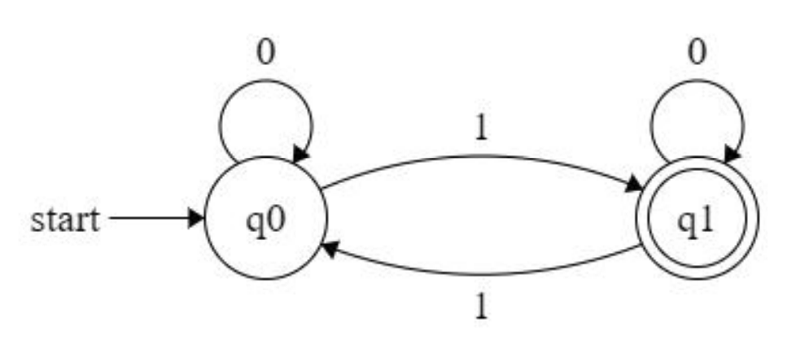
	- יש לפתור את השאלה לפי ההנחיות הבאות:
		- 1. הפכו את ה DFA ל- GNFA בן 4 מצבים.
		- 2. סלקו את מצב $q_1$.
		- 3. סלקו את מצב $q_0$. 
		- 4. רשמו את הביטוי הרגולרי שהתקבל.
	- **תשובה:**
		- $R=0^*10^*(10^*10^*)^*$ 
- ב. הוכיחו שהשפה $\text{EQ}_{\text{TM}}$ אינה ניתנת להכרעה; עשו זאת באמצעות רדוקציה מהשפה $\text{E}_{\text{TM}}$.
	- $\text{E}_{\text{TM}} = \{\langle M \rangle : M \text{ is a TM that with } L(M)=\emptyset \}$.
	- $\text{EQ}_{\text{TM}} = \{\langle M_1,M_2 \rangle : M_1,M_2\text{ are TM with }L(M_1) = L(M_2) \}$.
	- **תשובה:** (הוכחת משפט 5.4 מהספר).
		- נניח בשלילה ש- $\text{EQ}_{\text{TM}}$ ניתנת להכרעה.
			- אזי קיימת מ"ט $R$ שמכריעה את $\text{EQ}_{\text{TM}}$.
			- נבנה מ"ט $M$ כך: "עבור כל קלט $\langle M \rangle$, כאשר $M$ היא מ"ט: 
				- נריץ את $R$ על $\langle M,M_{1} \rangle$, כאשר $M_{1}$ היא מ"ט שדוחה כל קלט. 
				- אם $R$ מקבל, אז _נקבל_. אחרת, _נדחה_."
			- אם $R$ מכריעה את $\text{EQ}_{\text{TM}}$, אז $M$ מכריע את $\text{E}_{\text{TM}}$. אבל $\text{E}_{\text{TM}}$ אינה ניתנת להכרעה לפי משפט 5.2. סתירה.
		- מסקנה: $\text{EQ}_{\text{TM}}$ אינה ניתנת להכרעה.

## שאלה 5 

- יהי $G$ גרף לא מכוון. צביעה של $G$ ב- 3 צבעים נקראת _כמעט תקינה_ אם ישנה לכל היותר צלע אחת ששני הקודקודים בקצות הצלע צבועים באותו צבע. נגדיר את השפה הבאה:
	- $L=\{\langle G \rangle :$ גרף שיש לו צביעה כמעט תקינה ב- 3 צבעים $G$$\}$. 
	- תזכורת: צביעה נקראת _תקינה_ אם לכל שני קודקודים שכנים יש צבע שונה.
	- א. האם $L$ שייכת ל-NP? הוכיחו. 
		- **תשובה:** כן.
			- פונקציה $c:V(G) \to \{1,2,3\}$ שתסמן צביעה של $G$, תהווה certificate עבור $L$. 
			- מאמת $U$ יבדוק אם $c$ צובע כל קודקוד באחד מ- 3 הצבעים, וגם שיש לכל היותר צלע אחת שני הקודקודים שלה צבועים באותו צבע.
				- המאמת יעשה זאת על ידי ריצה על כל צלע $(u,v) \in E(G)$, ויספור כמה פעמים מתקיים $c(u)=c(v)$. אם הספירה היא לכל היותר 1, אז $c$ צובע את $G$ כמעט תקינה, אחרת לא.
				- זמן הריצה הוא $O(|E(G)|)$, שהוא פולינומיאלי בגודל הקלט $\langle G \rangle$.
			- מאחר שקיים מאמת $U$ שרץ בזמן פולינומיאלי, הרי ש- $L\in \text{NP}$ לפי הגדרת NP. 
	- ב. הראו כי ישנו גרף בן 4 קודקודים שאין לו צביעה תקינה ב- 3 צבעים. אבל יש לו צביעה כמעט תקינה ב- 3 צבעים.
		- **תשובה:** 
			- גרף שלם $K_4$ אינו ניתן לצביעה תקינה ב- 3 צבעים, מאחר שיש בו 4 קודקודים, בהכרח יש לפחות 2 קודקודים צבועים באותו צבע. אבל שני קודקודים אלו מחוברים בצלע שהרי זה גרף שלם, הרי ש-$K_4$ אינו ניתן לצביעה תקינה ב- 3 צבעים. 
			- אבל $K_4$ ניתן לצביעה כמעט תקינה ב- 3 צבעים, למשל: $c(v_1)=1$, $c(v_2)=2$, $c(v_3)=1$, $c(v_4)=3$. רק הצלע $(v_1,v_3)$ מחברת קודקודים צבועים באותו צבע, כלומר יש ל-$G$ צביעה כמעט תקינה ב- 3 צבעים.
	- ג. האם $L$ שפה NP-שלמה? הוכיחו או הפריכו.
		- **תשובה:**
			- נראה רדוקציה $3COLOR \leq_p L$. כאשר $3COLOR=\{\langle G \rangle : G \text{ is colorable with 3 colors} \}$.  
			- נגדיר פונקציה $f(\langle G \rangle) = \langle G' \rangle$, כאשר $G'=G\cup K_4$. (פונקציה זו ניתנת להרצה בזמן פולינומיאלי).
				- אם $\langle G \rangle \in 3COLOR$, אז $G$ ניתן לצביעה תקינה ב- 3 צבעים, אז $G'$ ניתן לצביעה כמעט תקינה ב- 3 צבעים, (כי $K_4$ ניתן לצביעה כמעט תקינה ב- 3 צבעים. והאיחוד שלהם לא מפריע, שהרי אין צלעות בין $G$ ל- $K_4$ ב-$G'$), ולכן $\langle G' \rangle \in L$. 
				- אם $\langle G \rangle \notin 3COLOR$, אז $G$ אינו ניתן לצביעה תקינה ב- 3 צבעים, ולכן $G'$ אינו ניתן לצביעה כמעט תקינה ב- 3 צבעים, ולכן $\langle G' \rangle \notin L$.
			- (1) אם כן, $\langle G \rangle \in 3COLOR \iff \langle G' \rangle \in L$, לכן $3COLOR \leq_p L$
			- (2) וגם ראינו בסעיף א' ש- $L\in \text{NP}$.
			- (3) וגם ידוע ש- $3COLOR$ היא NP-שלמה. (תרגיל 7.29 בספר).
			- מסקנה מ- (1), (2) ו- (3), לפי משפט 7.36: $L\in \text{NP-Complete}$. 

# מועד 2025a-a2

[https://mega.nz/folder/bZgRnQbJ#fBIkzvx7nLDUFMqGad6jOw/folder/7MwVVTAa](https://mega.nz/folder/bZgRnQbJ#fBIkzvx7nLDUFMqGad6jOw/folder/7MwVVTAa)

## שאלה 1א

- א. בנו DFA שמזהה את השפה שמקבל ה- NFA הבא: 
	- $M_{2}=(\Sigma,Q,δ,q_{\text{start}}​,F),\, \Sigma=\{a,b,c\}, Q=\{ q1​,q2​,q3​,q4​,q5​\},\, q_{\text{start}}​=q1​,\, F=\{ q4​ \}$
	- (הערה: אין צורך לצייר מצבים שלא ניתנים להשגה מהצב ההתחלתי).

$M_2 = (\Sigma, Q, \delta, q_{start}, F)$, $\Sigma = \{a,b,c\}$, $Q = \{q_1, q_2, q_3, q_4, q_5\}$, $q_{start} = q_1$, $F = \{q_4\}$

| $\delta$ (NFA)     | a                          | b                           | c                       | $\epsilon$              |
| ------------------ | -------------------------- | --------------------------- | ----------------------- | ----------------------- |
| $\color{red}q_{1}$ | $\color{blue}\{q_1, q_2\}$ | $\color{green}\{q_1, q_3\}$ | $\color{orange}\{q_1\}$ | $\{\}$                  |
| $q_2$              | $\{\}$                     | $\{q_3\}$                   | $\{q_4\}$               | $\{\}$                  |
| $\color{red}q_{3}$ | $\color{blue}\{\}$         | $\color{green}\{\}$         | $\color{orange}\{q_5\}$ | $\{\}$                  |
| $q_4$              | $\{\}$                     | $\{\}$                      | $\{\}$                  | $\{q_1\}$               |
| $q_5$              | $\{\}$                     | $\{\}$                      | $\{\}$                  | $\color{orange}\{q_4\}$ |

##### תשובה: 

נמיר ל-DFA. (סימנתי את המצב $\{ q_{1},q_{3} \}$ כדי להבהיר את העקרון).

| $\delta$ (DFA)                                | a                          | b                           | c                                  |
| --------------------------------------------- | -------------------------- | --------------------------- | ---------------------------------- |
| $\{q_{1}\}$                                   | $\{q_1, q_2\}$             | $\{q_1, q_3\}$              | $\{q_1\}$                          |
| $\{q_{2}\}$                                   | $\{\}$                     | $\{q_3\}$                   | $\{q_1, q_4\}$                     |
| $\{q_{3}\}$                                   | $\{\}$                     | $\{\}$                      | $\{q_1, q_4,q_{5}\}$               |
| $\{q_1, q_2\}$                                | $\{q_1, q_2\}$             | $\{q_1, q_3\}$              | $\{q_1, q_4\}$                     |
| $\{ {\color{red}q_{1}},{\color{red}q_{3}} \}$ | $\color{blue}\{q_1, q_2\}$ | $\color{green}\{q_1, q_3\}$ | $\color{orange}\{q_1, q_4,q_{5}\}$ |
| $\{q_1, q_4\}$                                | $\{q_1, q_2\}$             | $\{q_1, q_3\}$              | $\{q_1\}$                          |
| $\{q_1, q_4,q_{5}\}$                          | $\{q_1, q_2\}$             | $\{q_1, q_3\}$              | $\{q_1\}$                          |

המצבים המקבלים ב-DFA הם $\{q_1, q_4\}$, $\{q_1, q_4,q_{5}\}$. (כי הם מכילים את $q_4$).

## שאלה 1ב-ג

- ב. בנו NFA מעל הא"ב הבינארי שמקבל את שפת כל המילים באורך 2 או יותר שמתחילות ומסתיימות באותו תו.
	- $\Sigma = \{0,1\}$. 
	- $L=\{w \in \Sigma^* \mid w\text{ begins and ends with the same symbol with total length at least 2}\}$. 
	- **תשובה:** 
		- $(Q=\{q_0,q_1,q_2,q_3,q_4\},\Sigma=\{0,1\}, \delta, q_0, F=\{q_2,q_4\})$,  
		- 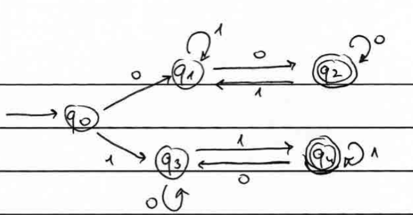
- ג. רשמו ביטוי רגולרי עבור השפה של סעיף ב'.
	- **תשובה:** $R = (0 (0\cup 1)^* 0)\cup (1 (0\cup 1)^* 1)$

## שאלה 2

- א. בנו דקדוק חסר-הקשר עבור השפה של הביטוי הרגולרי הבא: $00^*1^*$.  
	- **תשובה:** 
		- $S \to 0AB$
		- $A \to 0A \mid \varepsilon$
		- $B \to 1B \mid \varepsilon$
- ב. האם השפה הבאה היא חסרת-הקשר? הוכיחו. $L=\{ a^nb^m \mid m=n^2\}$.
	- **תשובה:** השפה אינה חסרת הקשר. הוכחה:
- ג. האם חיתוך של שפה חסרת הקשר עם שפה רגולרית הוא בהכרח שפה חסרת-הקשר? מדוע?
	- **תשובה:** 
	

## שאלה 3

- א. תהי $\varphi$ נוסחה בוליאנית על המשתנים $x_1,\ldots, x_n$. יהיו $x_i,x_j$ שני משתנים שונים. נאמר שהשמה $A$ של ערכים לכל $n$ המשתנים _מפרידה_ בין $x_{i}$ ל- $x_{j}$ אם היא נותנת לשני המשתנים ערכי אמת שונים. נסתכל בשפה הבאה: 
	- $L=\{ \langle \varphi, x_i, x_j \rangle : \varphi \text{ is 3CNF, } x_i,x_j \text{ are different, and there is an assignment satisfying } \varphi \text{ that separates } x_i \text{ and } x_j \}$.
		- א. הוכיחו ש-$L$ היא שפה ב- $\mathrm{NP}$.
		- ב. האם $L$ שפה NP-שלמה? מדוע?

## שאלה 4

- א. מצאו ביטוי רגולרי המתאר את השפה שמקבל ה-DFA הבא: 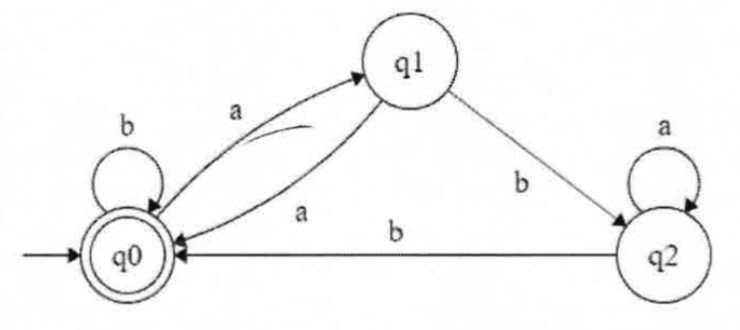
	- יש לפתור את השאלה לפי ההנחיות הבאות:
		- הפכו את ה DFA ל- GNFA בן 4 מצבים.
		- סלקו את מצב $q_2$.
		- סלקו את מצב $q_1$
		- סלקו את מצב $q_0$. 
		- רשמו את הביטוי הרגולרי שהתקבל.
	- **תשובה:**
		- $(b\cup (a(a\cup ba^* b))^*)^*$
- ב. הוכיחו השפה $L$ אינה ניתנת להכרעה. $L=\{ \langle M\rangle : M \text{ is a TM that accepts } \varepsilon \}$. 
	- רמז: רדוקציה מהשפה $A_{TM}=\{ \langle M,x \rangle : M \text{ is a TM that accepts } x \}$.
	- **תשובה:** 
		- $f(\langle M,x \rangle) = \langle M'\rangle$, 
		- $M'=$ $\text{``}$ On input  $w$:
			- if $w\neq \varepsilon$ then accept. 
			- if $w=\varepsilon$ then run $M$ on $x$. _accept_ if $M$ accepts, _reject_ if $M$ rejects."
		- אם $\langle M,x \rangle \in A_{TM}$, אז $M$ מקבל את $x$, ואז $M'$ מקבל את $\varepsilon$, כלומר $\langle M'\rangle \in L$.
		- אם $\langle M,x \rangle \notin A_{TM}$, אז $M$ לא מקבל את $x$, ואז $M'$ לא מקבל את $\varepsilon$, כלומר $\langle M'\rangle \notin L$.
		- קיבלנו ש- $\langle M,x \rangle \in A_{TM} \iff \langle M'\rangle \in L$, כלומר $A_{TM} \leq_m L$.
		- מאחר ש- $A_{TM}$ אינה ניתנת להכרעה, גם $L$ אינה ניתנת להכרעה.

## שאלה 5

- א. הוכיחו או הפריכו: יהיו $A$ ו- $B$ שפות הניתנות לזיהוי על ידי מכונת טיורינג. אזי $A \cup B$ גם ניתנת לזיהוי על ידי מ"ט.
	- **תשובה:** עבור כל שתי שפות $A$ ו-$B$ הניתנות לזיהוי על ידי מ"ט, נסמן את מ"ט המזהות אותן כ-$M_1$ ו-$M_2$. נבנה מ"ט $M'$ שמזהה את האיחוד של $A$ ו-$B$:
		- $\text{``}$ On input  $w$:
			- Run $M_1$ and $M_2$ alternately on $w$ step by step.  
				- If either accepts, _accept_.  
				- If both halt and reject, _reject_."
		- אם אחת מבין $M_1$ או $M_2$ מקבלת את $w$, אז $M'$ תקבל את $w$, כיוון שהמכונה שמקבלת מגיעה למצב מקבל לאחר מספר סופי של צעדים.  
- ב. הוכיחו או הפריכו: יהיו $A$ ו- $B$ שפות הניתנות לזיהוי על ידי מכונת טיורינג. אזי $A \cap B$ גם ניתנת לזיהוי על ידי מ"ט.
	- **תשובה:** עבור כל שתי שפות $A$ ו-$B$ הניתנות לזיהוי על ידי מ"ט, נסמן את מ"ט המזהות אותן כ-$M_1$ ו-$M_2$. נבנה מ"ט $M'$ שמזהה את החיתוך של $A$ ו-$B$:
		- $\text{``}$ On input  $w$:
			1. Run $M_1$ on $w$.  
				- If it halts and rejects, _reject_.  
				- If it accepts, go to stage 2.  
			2. Run $M_2$ on $w$.  
				- If it halts and rejects, _reject_.  
				- If it accepts, _accept_."
		- אם גם $M_1$ וגם $M_2$ מקבלות את $w$, הרי ש-$w \in A \cap B$ ולכן $M'$ תקבל את $w$ לאחר מספר סופי של צעדים.
- ג. נתונה מ"ט הבאה. רשמו את סדרת הקונפיגורציות שלה על הקלט $0\# 0$, כאשר כל המעברים שאינם מצויירים הולכים למצב דוחה.
	- $Q=\{q_0,q_1,\ldots, q_8,q_{accept},q_{reject}\}$, $\Sigma=\{0,1,\#\}$, $\Gamma=\{0,1,\#,x,\sqcup\}$ 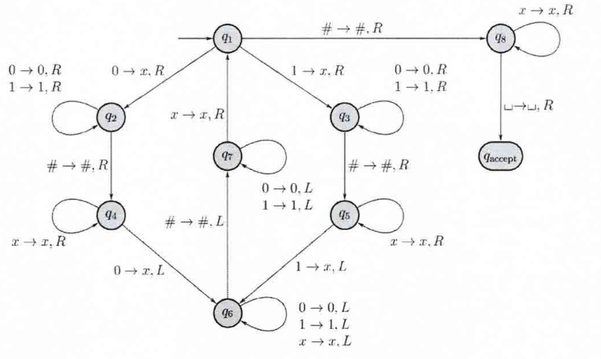
	- **תשובה:** 
		- $q_1 0\# 0$
		- $xq_2 \# 0$ 
		- $x \# q_4 0$ 
		- $x q_6 \# x$
		- $q_{7}x  \# x$
		- $x q_{1} \# x$
		- $x \#  q_{8} x$
		- $x \#   xq_{8}\sqcup$
		- $x \#   xq_{accept}\sqcup$

# מועד 2025a-b

[https://mega.nz/folder/bZgRnQbJ#fBIkzvx7nLDUFMqGad6jOw/folder/WdxhQBYA](https://mega.nz/folder/bZgRnQbJ#fBIkzvx7nLDUFMqGad6jOw/folder/WdxhQBYA)

[https://youtube.com/playlist?list=PLUfHxBkkFMSfS0lvlpXPJCUcZOscZ-4E7](https://youtube.com/playlist?list=PLUfHxBkkFMSfS0lvlpXPJCUcZOscZ-4E7)

## שאלה 1

- בנו DFA שמזהה את השפה מעל הא"ב הבינארי של המילים המכילות אות "1" לפחות פעם אחת, ומכילות אות "0" לכל היותר פעם אחת.
	- **תשובה:**

- נתונות שתי שפות מעל הא"ב הבינארי:
	- $L_1=\{0^k u 0^k \mid k\geq 1, u \in \Sigma^* \}$
	- $L_2=\{0^k 1u0^k \mid k\geq 1 \mid u \in \Sigma^* \}$
	- בדקו עבור כל אחת מהשפות אם היא רגולרית או לא. הוכיחו את תשובתכם.
		- **תשובה:**
			- השפה $L_1$ רגולרית. ביטוי רגולרי: $0\Sigma^* 0=0 (0\cup 1)^*0$
			- השפה $L_2$ אינה רגולרית. 
				- נניח ש- $L_2$ רגולרית. 
				- אזי קיים אורך ניפוח $p$.
				- ניקח את המילה $w=0^p 1 0^p$. שזו מילה ב- $L_2$.
				- לפי הלמה ניתן לכתוב $w=xyz$ כאשר $|xy| \leq p$ ו- $|y|>0$.
				- מכך ש- $|xy| \leq p$ וגם $|y|>0$, נובע ש- $y$ מכילה רק 0-ים, ומכילה לפחות 0 אחד. 
				- אזי כאשר ננפח את $y$ למעלה, נקבל מילה $x y^2 z = 0^{p+|y|} 1 0^p$, שהיא לא ב- $L_2$, כי יש בה יותר 0-ים בצד השמאלי מאשר בצד הימני. סתירה.
			- מסקנה: $L_2$ אינה רגולרית.

- האם השפה הבאה רגולרית. תנו הסבר קצר. $L=\{0^n1^n \mid 0\leq n \leq 6 \}$.
	- **תשובה:** השפה סופית ולכן רגולרית. (אפשר לבנות ב"ר המורכב מאיחוד $\cup$ של כל המחרוזות שבשפה).

## שאלה 2

- א. מהי השפה של ה- PDA הבא? תנו הסבר קצר. 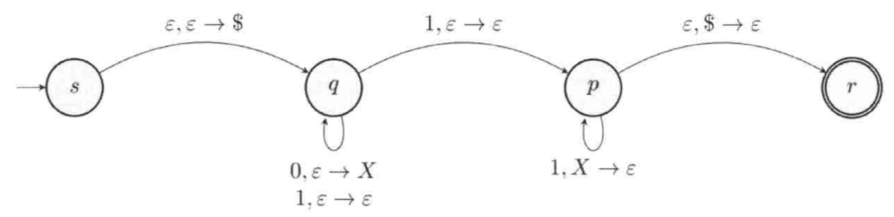 
	- **תשובה:**
- ב. הפכו את הדקדוק חסר-הקשר הבא לדקדוק בצורה נורמלית של חומסקי. יש לתאר את כל השלבים.
	- $A\to BAB$
	- $B\to 00$
	- **תשובה:**
		- 
- ג. האם השפה הבאה חסרת הקשר. $L=\{0^i 1^j 2^i 3^j \mid i,j \geq 0\}$.
	- **תשובה:** נניח בשלילה שהשפה חסרת הקשר. 
		- לפי למת הניפוח, המחרוזת $s=0^p1^p 2^p 3^p$, ניתנת לכתיבה כ- $s=uvxyz$, כאשר $|vxy| \leq p$ ו- $|vy|>0$.
		- ננפח למעלה, $uv^2xy^2z$, נקבל מחרוזת שאינה בשפה כי $vxy$ אינה יכולה להכיל גם 0-ים וגם 2-ים **או** גם 1-ים וגם 3-ים, ולכן לא ניתן לשמור על השוויון בניהם כאשר ננפח. 
		- מסקנה: השפה אינה חסרת הקשר.

## שאלה 3

- א. 
	- $\text{HAM-PATH}=\{ \langle G,s,t\rangle \mid G \text{ is directed and it has an hamiltonian path from }s\text{ to }t \}$
	- $\text{2HAM-PATH}=\{ \langle G,s,t\rangle \mid G \text{ is directed and it has  two different hamiltonian paths from }s\text{ to }t \}$
	- הוכיחו כי $\text{2HAM-PATH}\in \text{NP}$.
		- **תשובה:** 
- ב. האם $\text{2HAM-PATH}$ שפה NP-שלמה? מדוע?
	- **תשובה:** 
- ג. הוכיחו או הפריכו: אם $A\leq_P B$ אז יתכן ש- $A$ שייכת ל P אבל $B$ לא שייכת ל P.
	- **תשובה:** דוגמה: $B=HALT_{\text{TM}}$ ו- $A$ שפה כלשהיא ב- $\mathrm{P}$. (לכן $A$ ניתנת להכרעה בזמן פולינומיאלי).
		- אם $w\in A$, אז נגדיר מ"ט $f(w)=M$ שעוצרת על כל הקלטים. (למשל מחזירה תמיד 1).
		- אם $w\notin A$, אז נגדיר מ"ט $f(w)=M$ שעל כל קלט אינה עוצרת.
		- אם כן, $w\in A \iff f(w) \in B$.
		- הבנייה של $M$ היא בזמן פולינומיאלי, כי היא תלויה רק האם $w\in A$ או לא. שזה ניתן לבדוק בזמן פולינומיאלי.

## שאלה 4

- א. הוכיחו בעזרת רדוקציית מיפוי שהשפה המשלימה של השפה הבאה אינה ניתנת לזיהוי ע"י מ"ט. $L=\{ \langle M , D \rangle \mid M \text{ is a TM, } D \text{ is a DFA, and } L(M) = L(D) \}$
	- **תשובה:**
		- ידוע ש- $\overline{A_{\text{TM}}}$ אינה ניתנת לזיהוי ע"י מ"ט.
		- נראה ש- $\overline{A_{\text{TM}}} \leq_m \overline{L}$. 
			- נגדיר רדוקצית מיפוי $f(\langle M , w \rangle) = \langle M', D \rangle$ 
				- כאשר $M'$ הוא מ"ט שמוגדרת כך: "על קלט $x$:
					- אם $x\neq w$ אז נדחה.
					- אם $x=w$ אז נריץ את $M$ על $w$.
						- אם $M$ מקבלת אז נקבל.
						- אם $M$ דוחה אז נדחה." 
				- וכן, $D$ הוא DFA שמקבל את השפה $\{w\}$. 
				- נובע ש:  $\langle M,w\rangle \in \overline{A_{\text{TM}}} \iff \langle M',D\rangle \in \overline{L}$. 
		- מכיוון ש- $\overline{A_{\text{TM}}}$ אינה ניתנת לזיהוי ע"י מ"ט, וגם כפי שראינו ש- $\overline{A_{\text{TM}}} \leq_m \overline{L}$, אזי גם $\overline{L}$ אינה ניתנת לזיהוי ע"י מ"ט.
- ב. הוכיחו או הפריכו: מכל שפה $A$ אפשר לבנות רדוקציית מיפוי לשפה $A$. כלומר: $A \leq_m A$.
	- **תשובה:** הטענה נכונה. ניתן לבנות את הרדוקציה $f(w)=w$. ואז $w\in A \iff f(w)\in A$. 
- ג. הוכיחו או הפריכו: לכל שפה $A$ מתקיים: $A \leq_m \overline{A}$. 
	- **תשובה:** הטענה אינה נכונה. דוגמה נגדית: 
		- ניקח את השפה $A=A_{\text{TM}}$ שכידוע היא ניתנת לזיהוי ע"י מ"ט. וכן $\overline{A}=\overline{A_{\text{TM}}}$, שידוע שאינה ניתנת לזיהוי ע"י מ"ט. אם כך לא ניתן לבנות רדוקציית מיפוי מ- $A$ ל- $\overline{A}$, כי אם כן אזי $\overline{A}$ הייתה ניתנת לזיהוי ע"י מ"ט.

## שאלה 5

- א. האם השפה הבאה ניתנת להכרעה? הוכיחו. 
	- $\small L=\{ \langle M, k \rangle \mid M \text{ is a TM, } k \text{ is a positive number, and there exists an input to M that makes M run for at least k steps} \}$ 
	- **תשובה:** 
		- $\text{``}$ On input  $\langle M, k \rangle$ where $M$ is a TM and $k$ is a positive number:
			- For all strings $w_i$ where $|w_i|\leq k+1$:
				- Run $M$ on $w_i$ for $k$ steps.
					- If $M$ does not terminate within $k$ steps, then _accept_.
				- If we're finished enumerating and $M$ terminated within $k$ steps every time, then _reject_."
- ב. האם השפה הבאה ניתנת להכרעה? הוכיחו. $\text{SAT}=\{ \langle \phi \rangle : \phi \text{ is a Boolean formula with satisfying assignment} \}$  
	- **תשובה:** כן. נבנה מ"ט שתרוץ על כל ה- $2^n$ השמות האפשריות של ה- $n$ משתנים, ותבדוק אם אחת מהן מספקת את הנוסחה. (כל בדיקה אחת כזו נעשת בזמן סופי לפי גודל הנוסחה). אם כן, אז _accept_, אחרת _reject_. 

# מועד 2025b-66

## שאלה 1

- א. הוכיחו או הפריכו: אם $L^*$ שפה רגולרית, אזי גם $L$ שפה רגולרית.
	- **תשובה:** הטענה אינה נכונה. נראה דוגמה נגדית:
		- ניקח את השפה $L=\{a^p \mid p \text{ is prime} \}$ שאינה רגולרית. הוכחה:
			- נניח בשלילה ש- $L$ רגולרית. אזי קיים אורך ניפוח $p$.
			- נבחר את המילה בשפה $w=a^r$ כאשר $r$ ראשוני כך שלכל $1\leq b \leq p$, מתקיים ש $r+b$ אינו ראשוני. 
			- ננפח את $w$ ונקבל את $w_2 = xy^2z$, כאשר $|xy| \leq p$ ו- $|y|>0$.
				- מאחר ש- $|xy| \leq p$ ו- $|y|>0$, אזי $1\leq |y| \leq p$. ולכן $r+|y|$ אינו ראשוני, לכן $xy^2z = a^{r+|y|} \notin L$. בסתירה ללמה. 
			- מסקנה: $L$ אינה רגולרית.
		- אבל $L^*$ היא שפה רגולרית, (כי היא מכילה את כל המחרוזות של $a$-ים, באורך גדול או שווה ל- 2, ואת $\varepsilon$. כי $L$ מכילה את $aa$ ו- $aaa$) כלומר $L^* = \Sigma^* \setminus \{a\}$. ושפות רגולריות סגורות תחת הפרש קבוצות.
- ב. הוכיחו או הפריכו: אם שפה $L$ שונה משפה לא רגולרית $A$ במספר סופי של מחרוזות, אזי $L$ לא רגולרית.
	- **תשובה:** נניח בשלילה ש- $L$ רגולרית.
		- ניקח את השפה שהיא ההפרש הסימטרי $F=L\Delta A = (L\setminus A) \cup (A\setminus L)$. שהיא סופית לפי הנתון, ולכן רגולרית. 
		- מכך גם נובע ש- $A= L\Delta F$. אבל מאחר ש- $L$ ו- $F$ רגולריות, אזי גם $A$ רגולרית, (כי שפות רגולריות סגורות תחת איחוד והפרש קבוצות ולכן גם תחת הפרש סימטרי). סתירה לנתון ש- $A$ אינה רגולרית.
		- מסקנה: הטענה נכונה.
- ג. האם השפה הבאה רגולרית? הוכיחו או הפריכו. שפת כל המילים מעל הא"ב $\{ 0,1 \}$ שהן באורך אי-זוגי והאות האמצעית בהן שווה לאות הראשונה.
	- **תשובה:** 
		- השפה אינה רגולרית.
			- נניח בשלילה ש- $L$ רגולרית.
				- אזי קיים אורך ניפוח $p$.
				- ניקח את המילה $w=10^{p-1}10^{p}$. 
				- לפי הלמה ניתן לכתוב $w=xyz$ כאשר $|xy| \leq p$ ו- $|y|>0$.
				- מאחר ש- $|xy| \leq p$, אז $y$ לא מכילה את ה-$1$ האמצעי. 
					- אם $y$ מכילה את ה-$1$ הראשון, ניפוח למטה יביא לכך שהאות האמצעית תהיה שונה מהאות הראשונה, כלומר $xy^0z \notin L$.
				- אם $y$ לא מכילה את ה-$1$ הראשון, ניפוח למטה יביא לכך שה-$1$ האמצעי כבר לא יהיה אמצעי, כלומר $xy^0z \notin L$.
			- מסקנה: $L$ אינה רגולרית לפי הלמה לניפוח.

## שאלה 2

- א. האם השפה הבאה היא שפה חסרת הקשר? הוכיחו או הפריכו. $L=\{ a^n b^m : n \neq m\}$.
	- **תשובה:** נוכיח שכן בעזרת שני דקדוקים חסרי הקשר עבור שני שפות:
		- עבור $L_1 = \{ a^n b^m : n > m \}$.
			- $S \to aSb \mid A$
			- $A \to aA \mid a$
		- עבור $L_2 = \{ a^n b^m : n < m \}$
			- $S\to aSb \mid B$
			- $B\to Bb \mid b$
		- מאחר ששפות חסרות הקשר סגורות תחת איחוד, נובע ש- $L = L_1 \cup L_2 \in \text{CFL}$.
- ב. הוכיחו או הפריכו. אם L שפה חסרת הקשר, אזי $L\cap a^* b^* a^*$ גם שפה חסרת הקשר.
	- **תשובה:** הטענה נכונה לפי תרגיל 2.18a בספר שחיתוך של שפה חסרת הקשר עם שפה רגולרית הוא שפה חסרת הקשר.
- ג. האם השפה הבאה היא שפה חסרת הקשר? הוכיחו או הפריכו. $L=\{ ww^{\mathcal{R}} w : w\in \{a,b\}^* \}$.
	-  **תשובה:** נניח בשלילה ש- $L$ חסרת הקשר.
		- אזי קיים אורך ניפוח $p$. ניקח את המחרוזת $w=a^p b^p$. אזי המילה $ww^{\mathcal{R}} w=a^p b^{2p} a^{2p} b^p\in L$ ניתנת לכתיבה כ- $uvxyz$ כאשר $|vxy|\leq p$ ו- $|vy|>0$.
		- אם $vxy$ מורכבת רק מ- $a$-ים, או רק מ- $b$-ים, אזי ניפוח יביא למילה שאינה בשפה, למשל, $uv^2xy^2z=a^{p+|vy|} b^{2p} a^{2p} b^p \notin L$.
		- אחרת $vy$ היא מהצורה $a^i b^j$ או מהצורה $b^i a^j$, וגם אז ניפוח יביא למילה שאינה בשפה, למשל $uv^2xy^2z=a^{p} b^{2p+j} a^{2p+i} b^p \notin L$. 
		- בכל מקרה הגענו לסתירה ללמה לניפוח, ולכן $L$ אינה חסרת הקשר.

## שאלה 3

- נסתכל בשפה הבאה: $L=\{ \langle G, t\rangle : G \text{ contains a }2t \text{-clique} \}$
	- א. הוכיחו שהשפה $L$ שייכת ל- $\text{NP}$. 
		- **תשובה:** בהינתן certificate שהוא בעצם קבוצת צמתים בגודל $2t$, נוכל לבדוק בזמן פולינומיאלי $O(t^2)$ אם הם מהווים קליקה בגודל $2t$ ע"י בדיקת כל זוג צמתים אם יש ביניהם קשת.
	- ב. האם $L$ שפה NP-שלמה?
		- **תשובה:** כן. נראה רדוקציה מ- $\text{CLIQUE}_{k}$ ל- $L$. 
			- כאשר $\text{CLIQUE}_{k} = \{ \langle G, k\rangle : G \text{ has a }k\text{-clique} \}$.
			- נגדיר את הרדוקציה $f(\langle G, k \rangle) = \langle G', t = \lceil k/2 \rceil \rangle$, כאשר $G'=G$ אם $k$ זוגי, ו- $G'=G\cup \{v\}$ (כאשר $v$ מחובר לכל צומת ב- $G$) אם $k$ אי זוגי.
			- אם $k$ זוגי, אזי $k=2t$. בבירור $G'$ מכיל קליקה בגודל $2t$ אם ורק אם $G$ מכיל קליקה בגודל $k$.
			- אם $k$ אי זוגי, אזי $k=2t-1$. 
				- אם $G$ מכיל קליקה בגודל $k$, אזי $G$ מכיל קליקה בגודל $2t-1$, ולכן $G'$ מכיל קליקה בגודל $2t$ (כולל את הצומת $v$).
				- אם $G'$ מכיל קליקה בגודל $2t$, אזי $G'$ מכיל קליקה (לפחות) בגודל $2t-1$ (ללא הצומת $v$), ולכן $G$ מכיל קליקה בגודל $k$.
			- אזי $G$ מכיל קליקה בגודל $k$ אם ורק אם $G'$ מכיל קליקה בגודל $2t$. 
			- כלומר  $\langle G, k \rangle \in \text{CLIQUE}_{k} \iff f(\langle G, k \rangle) = \langle G', t = \lceil k/2 \rceil \rangle \in L$.
			- לכן $\text{CLIQUE}_{k} \leq_{\mathrm{P}} L$.
			- מכיוון ש- $\text{CLIQUE}_{k}\in \text{NP-complete}$ וגם $L\in \text{NP}$ אזי גם $L\in \text{NP-complete}$.

## שאלה 4

- א. הוכיחו שאם שפה $A$ ניתנת להכרעה אז קיימת רדוקציית מיפוי כזו: $A\leq_{\text{m}} a^* b^*$.
	- **תשובה:** מאחר ש- $A$ ניתנת להכרעה, אז יש מ"ט $M$ שמכריעה את $A$. 
		- $F=$ $\text{``}$ On input  $w$: 
			- Test whether $w \in A$ using $M$.
			- If $w\in A$, then output $\texttt{01}$
			- If $w\notin A$, then output $\texttt{10}$."
		- אם כן $w\in A \iff F(w) \in L( a^* b^*)$.
- ב. הוכיחו או הפריכו: אם $A\leq_{\text{m}} B$ אז $B\leq_{\text{m}} A$.
	- **תשובה:** הטענה אינה נכונה. דוגמה נגדית:
		- ניקח את השפה $A=\{ 0 \}$, שהיא כריעה, ו- $B=HALT_{\text{TM}}$ שאינה כריעה. 
		- אם $w\in A$, אז נגדיר מ"ט $f(w)=M$ שעוצרת על כל הקלטים. (למשל מחזירה תמיד 1).
		- אם $w\notin A$, אז נגדיר מ"ט $f(w)=M$ שעל כל קלט אינה עוצרת.
		- אם כן, $w\in A \iff f(w) \in B$. כלומר $A\leq_{\text{m}} B$.
		- אבל כמובן ש- $B\not\leq_{\text{m}} A$, שהרי $B$ אינה כריעה, ו- $A$ כן.
- ג. הוכיחו בעזרת רדוקציה שהשפה הבאה איננה כריעה: $T=\{ \langle M \rangle \mid M \text{ is a TM and } |L(M)|=1 \}$. 
	- **תשובה:** נראה שקיימת רדוקציית מיפוי מ- $A_{\text{TM}}$ ל- $T$. כלומר ש- $A_{\text{TM}} \leq_{\text{m}}T$.
		- נגדיר את הרדוקציה $f(\langle M, w \rangle) = \langle M' \rangle$, כאשר $M'$ הוא מ"ט שמוגדרת כך: "על קלט $x$:
			- אם $x=x_{0}$, אז נריץ את $M$ על $w$. (כאשר $x_0\in \Sigma^*$ היא מילה קבועה כלשהיא).
				- אם $M$ מקבל, אז נקבל. אם $M$ דוחה, אז נדחה.
			- אחרת נדחה".
		- אם $w\in A_{\text{TM}}$, אז $M'$ מקבל בדיוק מילה אחת, שהיא $x_0$, ולכן $|L(M')|=1$, ולכן $\langle M' \rangle \in T$.
		- אם $w\notin A_{\text{TM}}$, אז $M'$ דוחה את כל המילים, ולכן $|L(M')|=0$, ולכן $\langle M' \rangle \notin T$.
		- אם כן, $\langle M, w \rangle \in A_{\text{TM}} \iff \langle M' \rangle \in T$.
		- ולכן $A_{\text{TM}} \leq_{\text{m}} T$.
		- מאחר ש- $A_{\text{TM}}$ אינה ניתנת להכרעה, אזי גם $T$ אינה ניתנת להכרעה.

## שאלה 5

- א. הוכיחו או הפריכו: אם $L$ שפה ניתנת להכרעה, אזי גם $L^{\mathcal{R}}$ ניתנת להכרעה. תזכורת $L^{\mathcal{R}}=\{ w^{\mathcal{R}} \mid w\in L \}$.
	- **תשובה:** הטענה נכונה. 
		- אם $L$ ניתנת להכרעה, אז יש מ"ט $M$ שמכריע את $L$.
		- נבנה מ"ט $M'$ כך: "עבור כל קלט $w$:
			- נריץ את $M$ על $w^{\mathcal{R}}$. 
			- אם $M$ מקבל, אז $M'$ מקבל. אחרת, $M'$ ידחה".
		- אם כן, $M'$ מכריע את $L^{\mathcal{R}}$.
- ב. האם השפה המתקבלת משרשור שתי שפות שניתנות לזיהוי גם היא שפה ניתנת לזיהוי?
	- **תשובה:** כן, השפה המתקבלת משרשור שתי שפות שניתנות לזיהוי גם היא שפה ניתנת לזיהוי.
		- אם $L_1$ ו- $L_2$ הן שפות ניתנות לזיהוי, אז יש מ"ט $M_1$ שמזהה את $L_1$ ו- $M_2$ שמזהה את $L_2$.
		- נבנה מ"ט $M'$ כך: "עבור כל קלט $w$:
			- נעבור על כל האפשרויות (מספר סופי) לחלק את $w$ לשני חלקים $x$ ו- $y$, כך ש- $w=xy$.
			- נריץ את $M_1$ על $x$. 
				- אם הוא מקבל, נמשיך ונריץ את $M_2$ על $y$. 
					- אם הוא מקבל, אז נקבל."
		- אם כן, $M'$ מזהה את השפה המתקבלת משרשור שתי השפות.

# מועד 2025b-81

היה אמור להתקיים ב- 24.06. בסוף התקיים ב- 24.07.

## שאלה 1

- א. האם השפה הבאה מעל הא"ב $\{0,1\}$ רגולרית? אם כן הוכיחו בעזרת בניית DFA.
	- $L=\{ 0^m 1^n \mid m,n\geq 0 \text{ and } m+n \text{ is odd }\}$ 
	- **תשובה:** השפה רגולרית. נבנה DFA: 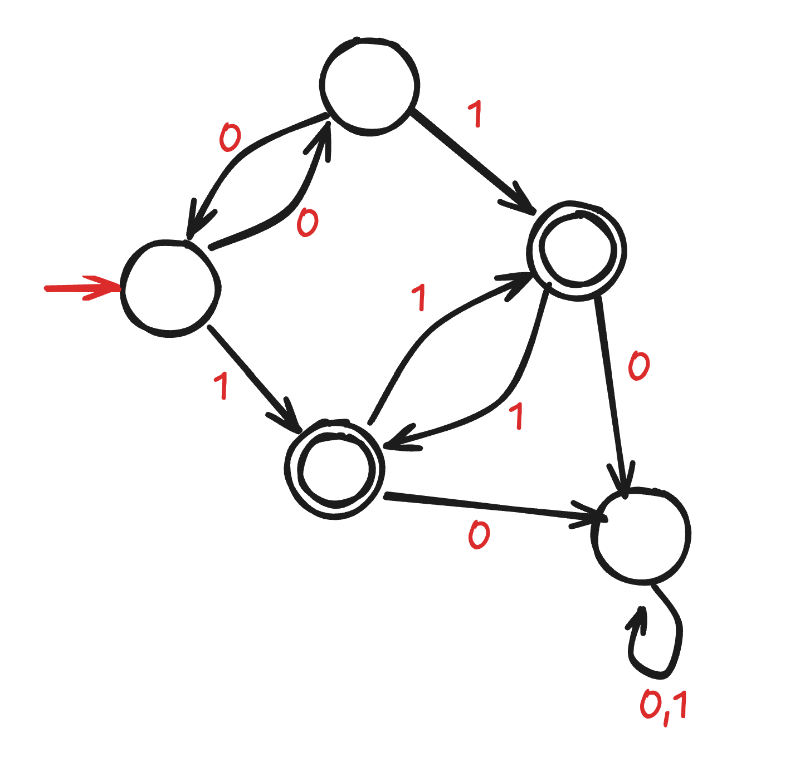
- ב. הפכו את ה- DFA הבא לביטוי רגולרי על ידי שימוש באלגוריתם שלמדנו לפי השלבים הבאים:
	- הפכו את ה- DFA ל-GNFA.
	- סלקו את מצב 1.
	- סלקו את מצב 2.
	- סלקו את מצב 3.
	- 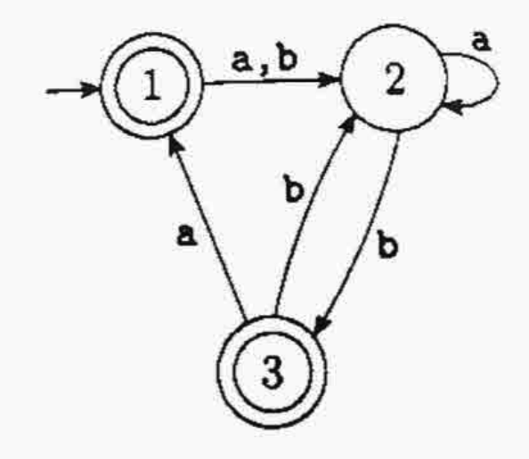
	- **תשובה:** (תרגיל 1.21b בספר).
		- <small>https://people.engr.tamu.edu/j-chen3/courses/627/2022/assignment/Solution2.pdf</small> 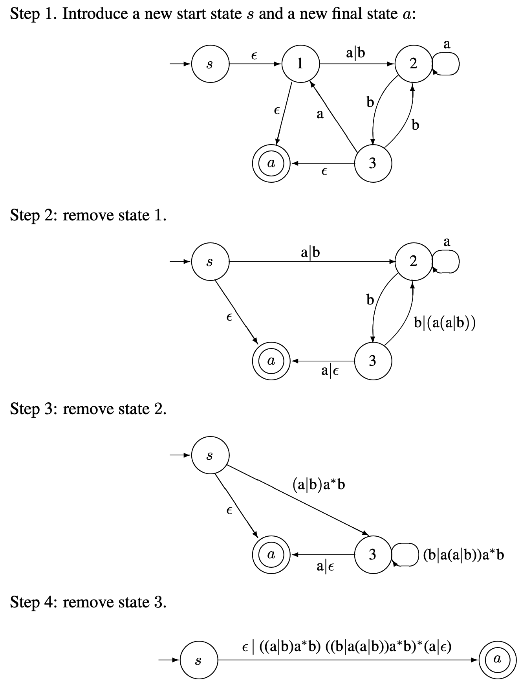
- ג. האם השפה הבאה רגולרית? הוכיחו או הפריכו. שפת כל המילים מעל הא"ב $\{0,1\}$ שמתחילות ומסתיימות באותה האות.
	- **תשובה:** השפה רגולרית. ב"ר: $0\cup 1\cup 0(0\cup 1)^*0  \cup 1(0\cup 1)^*1$.

## שאלה 2

- א. האם השפה הבאה היא חסרת הקשר? הוכיחו או הפריכו. $L=\{ a^m b^n : m \leq n \leq 3m\}$.
	- **תשובה:** השפה חסרת הקשר. דקדוק חסר הקשר:
		- $S\to aSb \mid aSbb \mid aSbbb \mid \varepsilon$ 
- ב. מהי השפה של הדקדוק הבא? האם היא רגולרית? תנו הסבר קצר.
	- $G=(V,\Sigma,R, S)$
		- $V=\{S,B\}$
		- $\Sigma=\{a,b\}$
		- $S$ - start variable 
		- $S\to aBa$
		- $B\to BB\mid b \mid \varepsilon$
	- **תשובה:** השפה היא כל המילים מהצורה $a b^n a$, כאשר $n\geq 0$.
		- השפה רגולרית, בעזרת ב"ר : $a b^* a$. 
- ג. בנו PDA (אוטומט מחסנית) עבור השפה הבאה:
	- $\Sigma =\{a,b,c,d\}$ 
	- $L=\{ cw\mid w\in \{a,b\}^*, w=w^{\mathcal{R}} \}\cup \{ dw \mid w\in \{a,b\}^* \}$
	- **תשובה:**  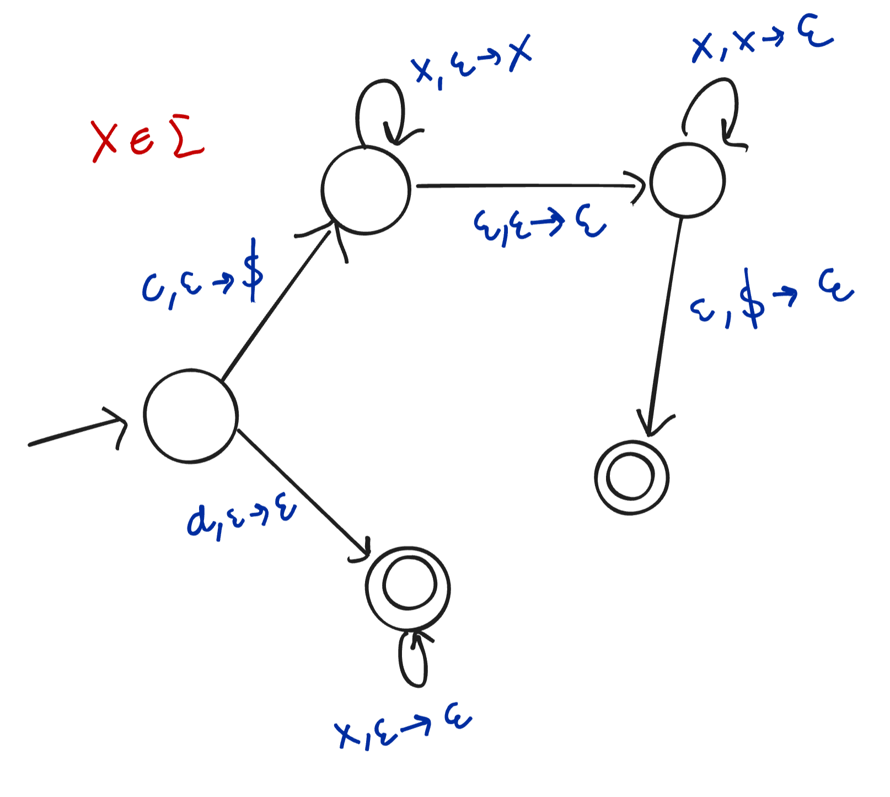

## שאלה 3

- א. האם השפה 4SAT היא שפה NP-שלמה. הוכיחו או הפריכו. נזכיר שב- 4SAT כל פסוק מורכב מפסוקיות שצורתן $(x_1\lor x_2\lor x_3\lor x_4)$, כלומר כל פסוקית היא איחוד של 4 ליטרלים (שיכולים להיות משתנים או שלילתם) ופסוק בשפה הוא גם הקוניונקציה של מספר סופי של פסוקיות כאלה (כלומר, חיבור שלהן באמצעות $\land$, "וגם"). 
	- **תשובה:** 
		- (1) השפה 4SAT היא ב- NP. שהרי בהינתן השמה $C$ של משתנים, נוכל לבדוק בזמן פולינומיאלי אם $C$ מספקת את הנוסחה. נבדוק כל פסוקית אם לפחות אחד מהליטרלים בה הוא true, כלומר אם לפחות אחד מהמשתנים או שלילתם הוא true. אם כל הפסוקיות הן true, אזי ההשמה מספקת את הנוסחה. זה נעשה בזמן פולינומיאלי של $O(n)$, כאשר $n$ הוא מספר הפסוקיות בנוסחה. מספר הליטרלים בכל פסוקית הוא קבוע.
		- (2) נראה רדוקצייה פולי' $3\text{SAT} \leq_{\mathrm{P}} \text{4SAT}$.
			- נגדיר פונקצייה $f:\text{3SAT}\to \text{4SAT}$ כך $f(\phi)=\phi'$, כאשר $\phi'$ היא נוסחה ב- 4SAT המתקבלת מהנוסחה $\phi$ ב-3SAT על ידי הוספת משתנה חדש $y$ לכל פסוקית ב- $\phi$, ובנוסף הוספת פסוקית $(\neg y \lor \neg y \lor \neg y \lor \neg y  )$. 
			- אזי אם נגדיר $y=false$ הספיקות של $\phi'$ לא תהייה שונה מהספיקות של $\phi$, שהרי נקבל ש- $(\neg y \lor \neg y \lor \neg y \lor \neg y  )=true$ ולא תשפיע על הספיקות, והמשתנים שהוספנו בתוך כל פסוקית יהיו $false$ וגם לא ישפיעו על הספיקות.
			- לכן מתקיים $\phi \in \text{3SAT} \iff \phi' \in \text{4SAT}$.
		- מ-1 ו-2 וגם מכך ש- ש-$3\text{SAT}\in \text{NP-complete}$, נובע לפי משפט ש-$\text{4SAT}\in \text{NP-complete}$.
- ב. יהי $G=(V,E)$ גרף לא מכוון. קבוצת קודקודים $S$ נקראת כמעט-קליקה אם אפשר להוסיף לכל היותר צלע אחת בין שני קודקודים של $S$ ובכך להפוך אותה $S$ לקליקה. 
	- הוכיחו שהשפה הבאה היא NP שלמה. $L=\{ \langle G, t \rangle \mid G \text{ is a graph that has a } t \text{-almost-clique} \}$.
	- **תשובה:** 
		- (1) קודם כל השפה $L$ היא ב- NP. 
			- בהינתן certificate $C$ שהוא קבוצה של קודקודים, נוכל לבדוק אם $C$ היא כמעט-קליקה בעזרת בדיקת כל זוג קודקודים ב- $C$ האם יש ביניהם צלע, למעט לכל היותר זוג אחד בלי צלע. ניתן לבדוק זאת בזמן פולינומיאלי של $O(|C|^2)$. 
		- (2) נראה רדוקציה פולי' מ- CLIQUE ל- $L$. כלומר נראה ש- $CLIQUE\leq_{\text{P}} L$
			- נגדיר פונקציה $f:L\to CLIQUE$ כך: $f(\langle G, t \rangle)=\langle G', t+2\rangle$, כאשר $G'=(V',E')$ הוא הגרף המתקבל מ- $G=(V,E)$ על ידי הוספת שני צמתים חדשים $v_{n+1}$ ו- $v_{n+2}$, והוספת צלעות בין כל צומת ב- $V$ לבין $v_{n+1}$ ו- $v_{n+2}$. (אך לא בין $v_{n+1}$ ל- $v_{n+2}$). 
			- נראה ש- $f$ היא רדוקציה פולינומית מ- $CLIQUE$ ל- $L$. כלומר שמתקיים $\langle G, t \rangle \in CLIQUE \iff \langle G', t+2 \rangle \in L$.
			- אם $G$ מכיל קליקה $C$ בגודל $t$, אזי $G'$ מכיל כמעט-קליקה בגודל $t+2$, שהיא $C\cup \{v_{n+1}, v_{n+2}\}$ כי ניתן להוסיף צלע בין שני הצמתים החדשים $v_{n+1}$ ו- $v_{n+2}$.
			- אם $G'$ מכיל כמעט-קליקה בגודל $t+2$, אז קיימים שני צמתים באותה הכמעט-קליקה שאין ביניהם צלע, אם נסיר אותם מהכמעט-קליקה, נקבל קליקה בגודל $t$ ב- $G$.
		- (3) כמו כן ידוע ש- CLIQUE היא NP-שלמה.
		- מסקנה: מ-1, 2 ו- 3, נובע לפי משפט ש-$L$ היא NP-שלמה. 
		
## שאלה 4 

- א. הוכיחו שהשפה הבאה כריעה.
	- $L = \{⟨M,k⟩ \mid$ $M$ is a TM, $k$ is a positive integer, and there exists an input to $M$ that makes $M$ run for at least $k$ steps $\}$
	- **תשובה:** נבנה מ"ט שמכריע את השפה $L$.
		- $\text{``}$ On input  $⟨M,k⟩$ where $M$ is a TM and $k$ is a positive integer:
			- For all strings $w_i$ where $|w_i|\leq k+1$:
				- Run $M$ on $w_i$ for $k$ steps.
					- If $M$ does not terminate within $k$ steps, then _accept_.
				- If we're finished enumerating and $M$ terminated within $k$ steps every time, then _reject_."
- ב. האם השפה הבאה ניתנת להכרעה? 
	- $\{⟨R⟩\mid R$ is a regular expression describing a language containing at least one string $w$ that has $111$ as a substring $\}$
	- **תשובה:** (תרגיל 4.16 מהספר).
		- כן, השפה ניתנת להכרעה. נבנה מ"ט שתכריע אותה.
			- $\text{``}$ On input  $⟨R⟩$ where $R$ is a regular expression:
				- Construct DFA $E$ that accepts $\Sigma^* 111 \Sigma^*$.
				- Construct DFA $B$ s.t. $L(B)=L(R)\cap L(E)$. 
				- Run TM $T$ on $\langle B \rangle$, where $T$ decides $E_{\textsf{DFA}}$.
				- If $T$ accepts, then _reject_. If $T$ rejects, then _accept_."

___

# תרגילים 

https://www.cs.rice.edu/~nakhleh/COMP481/final_review_sp06_sol.pdf

## פרק 4

- הוכיחו או הפריכו את הטענה הבאה: "אם $L$ שפה הניתנת להכרעה, ו- $A\subseteq L$, אזי גם $A$ שפה הניתנת להכרעה".
	- **תשובה:** הטענה אינה נכונה. דוגמה נגדית: 
		- השפה $L=\Sigma^*$ כריעה על ידי מ"ט שמקבלת כל קלט.
		- השפה $A_{\text{TM}}\subseteq L$ אינה כריעה. (לפי משפט 4.11).
- הוכיחו או הפריכו את הטענה הבאה: "אם $L$ שפה הניתנת לזיהוי ו- $A\subseteq L$, אזי גם $A$ שפה הניתנת לזיהוי".
	- **תשובה:** הטענה נכונה. 
		- אם $L$ ניתנת לזיהוי, אז יש מ"ט $M$ שמזהה את $L$.
		- נבנה מ"ט $M'$ כך: "עבור כל קלט $w$:
			- אם $w\in A$, אז $M'$ יריץ את $M$ על $w$ ויקבל.
			- אחרת, $M'$ ידחה".
		- אם $A\subseteq L$, אז $M'$ מזהה את $A$.

- תהיינה $M_1$ ו-$M_2$ מ"ט, **המכריעות** את השפות $L_1$ ו-$L_2$ בהתאמה.
	- בנו מ"ט $M$ המזהה את השפה $L_1 \cdot L_2$. 
	- **תשובה:** 
		- נבנה מ"ט לא-דטרמיניסטית (NTM) $M$ שמזהה את השפה $L_1 \cdot L_2$.
		- המכונה $M$ תעבור על כל האפשרויות לחלק את הקלט $w$ שאורכו $n$ לשני חלקים. (אפשרי כי היא לא-דטרמיניסטית..), ואז תריץ את $M_1$ על החלק הראשון, ואת $M_2$ על החלק השני.
		-  $M=\text{``On input }w$
			1. Split $w$ into two parts $w[1:i]$ and $w[i+1:n]$ for all $i=0,1,\ldots,n$.
			2. Run $M_1$ on $w[1:i]$. If $M_1$ accepts, then run $M_2$ on $w[i+1:n]$, if $M_2$ accepts, _accept_.
			3. If all iterations of $i$ ended without accepting, _reject_. $\text{''}$
- תהי $M_1$ מ"ט **המזהה** את השפה $L_1$. בנו מ"ט $M$ שמזהה את $L_1^*$.
	- **תשובה:**
		- באופן דומה לשאלה הקודמת, נבנה מ"ט לא-דטרמיניסטית (NTM) $M$ שמזהה את השפה $L_1^*$. 
		- המכונה $M$ תעבור על כל האפשרויות לחלק את הקלט $w$ שאורכו $n$ ל-$k$ חלקים. (כנל כאן, אפשרי בגלל אי-דטרמיניזם). ואז תריץ את $M_1$ על כל חלק בנפרד, אם $M_1$ מקבלת את כולם, אז $M$ מקבלת. אחרת, כלומר אם יש חלק אחד שלא מקבל, אז $M$ לא מקבלת (את אותה חלוקה כמובן).

## פרק 5

- הוכיחו שהשפה הבאה לא ניתנת להכרעה.
	- $S_{TM}=\{ \langle M \rangle \mid M \text{ is a TM that accepts }w^{\mathcal{R}}\text{ whenever it accepts }w\}$. 
	- **תשובה:**
		- נניח בשלילה ש- $S_{TM}$ ניתנת להכרעה.
		- אזי קיימת מ"ט $S$ שמכריעה את $S_{TM}$.
		- נראה רדוקציה מ- $\text{A}_{\text{TM}}$ ל- $S_{TM}$.
			- On input $\langle M,w \rangle$, where $M$ is a TM and $w$ is a string:
				- Check if $\langle M,w \rangle$ is a valid encoding of a TM and a string. If not _reject_.
				- Construct the following TM $M_2=$$\text{``}$ On input  $x$:
					- If $x\in L(00^*11^*)$, _accept_. 
					- If $x\in L(11^*00^*)$, then run $M$ on $w$. 
						- If $M$ accepts $w$, _accept_.
						- If $M$ rejects $w$, _reject_.
					- Run $S$ on $\langle M_2 \rangle$. _accept_ if $S$ accepts, _reject_ if $S$ rejects.
	- אם כן מצאנו מ"ט המכריעה את $\text{A}_{\text{TM}}$. אבל ידוע ש- $\text{A}_{\text{TM}}$ אינה ניתנת להכרעה. סתירה.
	- מסקנה: $S_{TM}$ אינה ניתנת להכרעה.

- נתונה השפה הבאה: $E_{\text{TM}}=\{\langle M \rangle : M \text{ is a TM with }L(M)=\emptyset\}$. הוכיחו שהשפה היא co-Turing-recognizable. 
	- **תשובה:**
		- נסמן $s_1,s_2,s_3,\ldots$ את סדרת המילים ב $\Sigma^*$. 
		- לכל קלט $\langle M\rangle$ כאשר $M$ היא מ"ט:
			- לכל $i=1,2,\ldots$:
				- נריץ את $M$ על כל אחד מ- $s_1,s_2,\ldots,s_i$, **לכל היותר** $i$ צעדים. 
				- אם $M$ מקבלת מילה כלשהי, נקבל.
		- אם אכן $L(M)\neq\emptyset$, בסופו של דבר $M$ תסיים את הריצה כי אינה יכולה להכנס ללופ אינסופי. שהרי הגבלנו את מספר הצעדים על כל מילה.
- הוכיחו שאם $A$ מזוהה טיורינג, ו- $A\leq_m \overline {A}$, אזי $A$ ניתנת להכרעה.
	- **תשובה:** 
		- מכך ש- $A\leq_m \overline {A}$, נובע ש- $\overline {A}\leq_m A$. 
		- מהנתון ש- $A$ מזוהה טיורינג, וגם ש- $\overline {A}\leq_m A$, נובע ש- $\overline {A}$ מזוהה טיורינג.
		- מכך שגם $A$ וגם $\overline {A}$ מזוהות טיורינג, נובע ש- $A$ ניתנת להכרעה.

## פרק 7

- הוכיחו שמחלקה $\text{P}$ סגורה תחת איחוד.
	- **תשובה:** 
		* תהינה $L_1$ ו-$L_2$ שפות ב-$P$. אזי קיימים DTM $M_1$ ו-$M_2$ המכריעים אותן בזמן פולינומיאלי.
		* נניח $M_1$ רצה בסיבוכיות: $O(n^{k_1})$ ו-$M_2$ רצה בסיבוכיות $O(n^{k_2})$ כאשר $n$ – אורך קלט ו-$k_1,k_2$ קבועים.
		* נבנה מ"ט $M_3$ המכריע $L_1 \cup L_2$. $M_3$ ="על קלט $w$ תעבוד כך:
		    * תריץ $M_1$ על $w$ ואם $M_1$ מקבלת גם $M_3$ תקבל
		    * תריץ $M_2$ על $w$ ואם $M_2$ מקבלת גם $M_3$ תקבל, 
		    * אחרת $M_3$ תדחה."
		* הוכחת נכונות:
		    * אם $w$ שייכת לאיחוד השפות, אז היא שייכת או ל-$L_1$ או ל-$L_2$ ואז $M_3$ יקבל $w$ כאשר תריץ $M_1$ או $M_2$. $M_1, M_2$ מכריעות ולכן תמיד עוצרות ולכן גם $M_3$ תמיד עוצרת.
		    * המ"ט $M_3$ מקבלת $w$ אם"ם היא שייכת לאיחוד השפות. 
		    * סיבוכיות זמן ריצה: $O(n^{k_1}) + O(n^{k_2}) = O(n^{\max(k_1, k_2)})$ - פולינומיאלית.

## נכון / לא נכון

- כל שפה היא מזוהה-טיורינג.
	- **תשובה:** לא נכון. דוגמה נגדית: השפה $\overline{A_{\text{TM}}}$ אינה מזוהה-טיורינג (מסקנה 4.23).
- אם $A\neq B$ אז $\overline{A}\cap B\neq \emptyset$ ו- $\overline{B}\cap A\neq \emptyset$.
- אם $B$ חסרת הקשר ו- $A\subseteq B$ אז $A$ חסרת הקשר.
	- **תשובה:** לא נכון. דוגמה נגדית: 
		- $\Sigma^*=\{a,b,c\}$.
		- $B=\Sigma^*$ חסרת הקשר. 
		- $A=\{a^nb^n c^n \mid n \geq 0\}$ אינה חסרת הקשר.
		- $A\subseteq B$.
- השפה $L=\{a^nb^n \mid n \leq 100\}$ אינה רגולרית.
	- **תשובה:** לא נכון. השפה $L=\{a^nb^n \mid n \leq 100\}=\{a^0b^0,a^1b^1,\ldots,a^{100}b^{100}\}$ היא שפה סופית ולכן רגולרית.
- השפה $L=\{a^nwa^n \mid w \in \{a,b\}^* \}$ מעל $\Sigma=\{a,b\}$ אינה רגולרית אבל כן חסרת הקשר. 
	- **תשובה:** לא נכון. $L$ היא רגולרית בעזרת הביטוי הרגולרי $a(a\cup b)^*a$.

# דף נוסחאות

דף שאני מכין לעצמי למבחן, אולי יעזור לאחרים. עדיין חלקי.

  <a href="cheatsheet/cheatsheet.pdf">https://adielbm.github.io/20604/cheatsheet/cheatsheet.pdf</a>.
